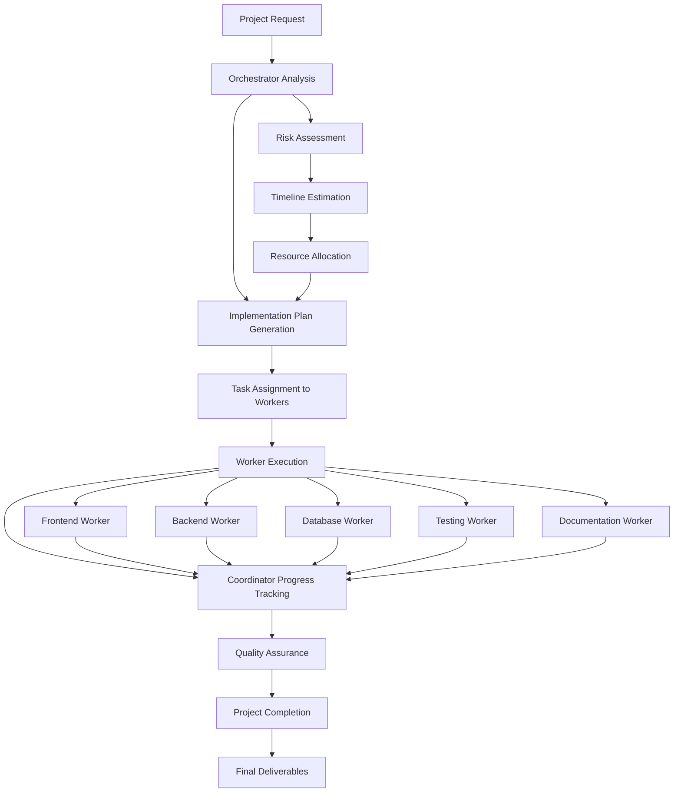

# Orchestrator-Worker Agent Flow

This document describes the internal flow and decision-making process of the Orchestrator-Worker Agent Pattern, built using AI SDK v5 with strongly typed tools and the `Experimental_Agent` class.

## Overview

The agent is designed to be **coordinated** and **specialized**, using an orchestrator to break down complex projects into manageable tasks and coordinate specialized workers. Built with AI SDK v5's strongly typed tools and `UIToolInvocation` patterns for enhanced type safety and streaming capabilities.

## Current Implementation

The agent uses the `Experimental_Agent` class with three core tools:

- **orchestrator**: Plans and breaks down complex requests into implementation plans
- **worker**: Executes specialized tasks with domain-specific expertise
- **coordinator**: Manages the orchestration process with mandatory workflow controls

## Core Decision Flow



## Project Classification

The agent uses a **project-based approach** to determine the appropriate workflow:

### Simple Projects

**Characteristics:**

- Single-component tasks
- Straightforward implementations
- Minimal dependencies
- Clear requirements

**Examples:**

- "Create a simple login form"
- "Add a contact page"
- "Implement basic validation"

**Tool Usage:** 2-3 tools maximum

- `orchestrator` (planning)
- `worker` (execution)
- `coordinator` (completion)

### Complex Projects

**Characteristics:**

- Multi-component systems
- Complex integrations
- Multiple dependencies
- Strategic planning required

**Examples:**

- "Build a full-stack e-commerce platform"
- "Create a real-time chat application"
- "Develop a machine learning pipeline"

**Tool Usage:** 5-10 tools

- `orchestrator` (comprehensive planning)
- `worker` (multiple specialized tasks)
- `coordinator` (progress tracking and coordination)

## Step-by-Step Execution Flow

### Phase 1: Project Analysis (Step 0)

```typescript
// Agent definition with strongly typed tools
export const orchestratorAgent = new Agent({
  model: openai("gpt-4.1-mini"),
  system: `You are an Orchestrator-Worker Agent that excels at coordinating complex projects through specialized workers.

## Your Role
You are a senior project manager and technical architect who can:
1. **Orchestrate**: Break down complex requests into manageable tasks
2. **Coordinate**: Manage dependencies and track progress across multiple workers
3. **Delegate**: Assign specialized tasks to appropriate workers based on their expertise

## Available Workers
- **Research Worker**: Analyzes requirements, conducts market research, and provides technical specifications
- **Design Worker**: Creates UX flows, system architecture, and visual mockups
- **Frontend Worker**: Implements user interfaces, components, and client-side functionality
- **Backend Worker**: Develops APIs, services, and server-side logic
- **Database Worker**: Designs schemas, optimizes queries, and manages data
- **API Worker**: Integrates external services and manages API connections
- **Testing Worker**: Creates comprehensive test suites and ensures quality
- **Documentation Worker**: Writes user guides, API docs, and technical documentation
- **Deployment Worker**: Sets up CI/CD, configures infrastructure, and manages releases

## Workflow
1. **Plan**: Use the orchestrator tool to break down the request into tasks
2. **Start**: Use the coordinator tool with action "start" to initiate the process
3. **Execute**: Use the worker tool to assign and execute specialized tasks
4. **Monitor**: After every 2-3 worker tasks, use the coordinator tool with action "check_progress"
5. **Resolve**: If any worker task fails or is blocked, use the coordinator tool with action "resolve_blocker"
6. **Complete**: When all tasks are done, use the coordinator tool with action "complete"

## Guidelines
- Always start with orchestration to create a comprehensive plan
- **MANDATORY**: Use coordinator tool with "start" action after planning
- Assign tasks to workers based on their specialized expertise
- **MANDATORY**: Use coordinator tool with "check_progress" after every 2-3 worker tasks
- **MANDATORY**: Use coordinator tool with "resolve_blocker" if any worker task fails
- **MANDATORY**: Use coordinator tool with "complete" action when all tasks are finished
- Provide clear, actionable feedback and next steps
- Ensure all deliverables meet quality standards
- Communicate progress and any issues clearly to the user

## Coordinator Usage Rules
- **Always** use coordinator "start" after orchestrator planning
- **Always** use coordinator "check_progress" after 2-3 worker tasks
- **Always** use coordinator "resolve_blocker" when worker tasks fail
- **Always** use coordinator "complete" when all tasks are finished
- Pass task results to coordinator when available for accurate progress tracking`,
  tools: {
    orchestrator: orchestratorTool,
    worker: workerTool,
    coordinator: coordinatorTool,
  },
  stopWhen: stepCountIs(15),
});
```

**Agent Decision Process:**

1. Analyze project scope and complexity using AI SDK v5's `Experimental_Agent`
2. Determine required worker types from strongly typed `UIToolInvocation` definitions
3. Plan execution strategy with streaming tool states

### Phase 2: Planning Phase (Steps 1-3)

#### For Simple Projects:

```typescript
// Strongly typed orchestrator tool with streaming states
export const orchestratorTool = tool({
  description: "Plan and coordinate project implementation",
  inputSchema: z.object({
    request: z.string().describe("Project request description"),
    context: z.string().optional().describe("Additional context"),
  }),
  async *execute({ request, context }) {
    yield { state: "loading" as const };
    // ... planning logic
    yield { state: "ready" as const, plan: implementationPlan };
  },
});
```

#### For Complex Projects:

```typescript
// Comprehensive project planning with multiple phases
const orchestratorInvocation = await orchestratorTool.execute({
  request: "Build a full-stack e-commerce platform",
  context: "Modern tech stack, scalable architecture",
});

// Generate detailed implementation plan
const plan = orchestratorInvocation.output.plan;
```

**System Prompt:**

```
"📋 PROJECT PLANNING: Create a comprehensive implementation plan with clear tasks,
dependencies, and timelines. Assign appropriate worker types for each task based on
their expertise and the project requirements."
```

### Phase 3: Worker Assignment Phase (Steps 4-8)

**For All Projects:**

```typescript
// Strongly typed worker tool with streaming states
export const workerTool = tool({
  description: "Execute specialized tasks with specific expertise",
  inputSchema: z.object({
    taskId: z.string().describe("Unique task identifier"),
    workerType: z
      .enum([
        "frontend",
        "backend",
        "database",
        "api",
        "testing",
        "documentation",
        "research",
        "design",
        "deployment",
      ])
      .describe("Type of worker specialization"),
    description: z.string().describe("Task description"),
    requirements: z.array(z.string()).describe("Task requirements"),
  }),
  async *execute({ taskId, workerType, description, requirements }) {
    yield { state: "loading" as const };
    // ... worker execution logic
    yield { state: "ready" as const, result: workerResult };
  },
});
```

**System Prompt:**

```
"👷 WORKER EXECUTION: Assign tasks to appropriate specialized workers based on
their expertise. Each worker should focus on their area of specialization and
produce high-quality deliverables."
```

### Phase 4: Coordination Phase (Steps 9-12)

**For Complex Projects:**

```typescript
// Strongly typed coordinator tool with streaming states
export const coordinatorTool = tool({
  description: "Coordinate project progress and resolve issues",
  inputSchema: z.object({
    planId: z.string().describe("Implementation plan identifier"),
    action: z
      .enum([
        "start",
        "check_progress",
        "resolve_blocker",
        "complete",
        "pause",
        "resume",
      ])
      .describe("Coordination action"),
    context: z.string().optional().describe("Additional context"),
  }),
  async *execute({ planId, action, context }) {
    yield { state: "loading" as const };
    // ... coordination logic
    yield { state: "ready" as const, result: coordinationResult };
  },
});
```

**System Prompt:**

```
"🎯 COORDINATION: Monitor project progress, resolve blockers, and ensure
all tasks are completed successfully. Coordinate between different workers
and maintain project quality standards."
```

### Phase 5: Quality Assurance (Steps 13+)

**System Prompt:**

```
"✅ QUALITY ASSURANCE: Review all deliverables, ensure they meet requirements,
and coordinate final project completion. Verify that all tasks are properly
integrated and the project is ready for delivery."
```

## Tool Execution Patterns

### Orchestrator Tool

```typescript
// Strongly typed orchestrator tool with streaming states
export const orchestratorTool = tool({
  description:
    "Plan and coordinate complex tasks by breaking them down into manageable subtasks",
  inputSchema: z.object({
    request: z
      .string()
      .describe("The complex task or feature request to orchestrate"),
    context: z
      .string()
      .optional()
      .describe("Additional context about the project or requirements"),
    constraints: z
      .array(z.string())
      .optional()
      .describe("Any constraints or limitations to consider"),
    priority: z
      .enum(["low", "medium", "high", "urgent"])
      .default("medium")
      .describe("Overall priority of the task"),
  }),
  async *execute({ request, context, constraints, priority }) {
    yield { state: "loading" as const };

    // Generate implementation plan with 6 standard phases
    const implementationPlan = {
      request,
      context: context || "No additional context provided",
      constraints: constraints || [],
      priority,
      items: [
        {
          purpose: "Research and analyze requirements",
          category: "research" as const,
          deliverable:
            "Requirements analysis document with technical specifications",
          priority: "high" as const,
          estimatedComplexity: "medium" as const,
          dependencies: [],
          estimatedDuration: "1-2 hours",
        },
        {
          purpose: "Design system architecture and user experience",
          category: "design" as const,
          deliverable: "System architecture diagrams and UX wireframes",
          priority: "high" as const,
          estimatedComplexity: "high" as const,
          dependencies: ["requirements-analysis"],
          estimatedDuration: "2-3 hours",
        },
        {
          purpose: "Develop core functionality and APIs",
          category: "development" as const,
          deliverable: "Working application with core features implemented",
          priority: "high" as const,
          estimatedComplexity: "high" as const,
          dependencies: ["system-design"],
          estimatedDuration: "4-6 hours",
        },
        {
          purpose: "Create comprehensive test suite",
          category: "testing" as const,
          deliverable:
            "Unit tests, integration tests, and test coverage report",
          priority: "medium" as const,
          estimatedComplexity: "medium" as const,
          dependencies: ["core-development"],
          estimatedDuration: "2-3 hours",
        },
        {
          purpose: "Deploy and configure production environment",
          category: "deployment" as const,
          deliverable: "Live application deployed with monitoring and logging",
          priority: "medium" as const,
          estimatedComplexity: "medium" as const,
          dependencies: ["testing-complete"],
          estimatedDuration: "1-2 hours",
        },
        {
          purpose: "Create user documentation and API docs",
          category: "documentation" as const,
          deliverable:
            "User guide, API documentation, and developer onboarding guide",
          priority: "low" as const,
          estimatedComplexity: "low" as const,
          dependencies: ["deployment-complete"],
          estimatedDuration: "1-2 hours",
        },
      ],
      estimatedDuration: "8-12 hours total",
      riskLevel: "medium",
      successCriteria: [
        "All requirements are met and validated",
        "System follows architectural best practices",
        "Comprehensive test coverage (>80%)",
        "Application is deployed and accessible",
        "Documentation is complete and user-friendly",
      ],
    };

    yield { state: "ready" as const, plan: implementationPlan };
  },
});

export type OrchestratorUIToolInvocation = {
  state:
    | "loading"
    | "ready"
    | "input-streaming"
    | "input-available"
    | "output-available"
    | "output-error";
  input?: {
    request: string;
    context?: string;
    constraints?: string[];
    priority: "low" | "medium" | "high" | "urgent";
  };
  output?: {
    state: "loading" | "ready";
    plan?: {
      request: string;
      context: string;
      constraints: string[];
      priority: string;
      items: Array<{
        purpose: string;
        category:
          | "research"
          | "design"
          | "development"
          | "testing"
          | "deployment"
          | "documentation";
        deliverable: string;
        priority: "low" | "medium" | "high";
        estimatedComplexity: "low" | "medium" | "high";
        dependencies?: string[];
        estimatedDuration: string;
      }>;
      estimatedDuration: string;
      riskLevel: string;
      successCriteria: string[];
    };
  };
  errorText?: string;
};
```

### Worker Tool

```typescript
// Strongly typed worker tool with streaming states
export const workerTool = tool({
  description:
    "Execute specialized tasks assigned by the orchestrator with domain-specific expertise",
  inputSchema: z.object({
    taskId: z.string().describe("Unique identifier for this task"),
    workerType: z
      .enum([
        "frontend",
        "backend",
        "database",
        "api",
        "testing",
        "documentation",
        "research",
        "design",
        "deployment",
      ])
      .describe("Type of worker needed for this task"),
    description: z
      .string()
      .describe("Detailed description of the task to be performed"),
    requirements: z
      .array(z.string())
      .describe("Specific requirements and constraints for this task"),
    context: z
      .string()
      .describe("Additional context about the project and dependencies"),
    expectedOutput: z
      .string()
      .describe("What the worker should produce as output"),
    priority: z
      .enum(["low", "medium", "high", "urgent"])
      .default("medium")
      .describe("Task priority"),
  }),
  async *execute({
    taskId,
    workerType,
    description,
    requirements,
    context,
    expectedOutput,
    priority,
  }) {
    yield { state: "loading" as const };

    // Simulate work execution based on worker type and priority
    const workDuration =
      priority === "urgent" ? 500 : priority === "high" ? 1000 : 1500;
    await new Promise((resolve) => setTimeout(resolve, workDuration));

    // Generate worker-specific output based on type
    const workerOutputs = {
      frontend: {
        output: `Frontend implementation completed for task: ${description}`,
        explanation: `Created responsive UI components using modern frameworks, implemented state management, and ensured accessibility compliance.`,
        deliverables: [
          {
            name: "Component Library",
            type: "code" as const,
            content:
              "React components with TypeScript, styled with Tailwind CSS",
            status: "completed" as const,
          },
          {
            name: "User Interface Mockups",
            type: "design" as const,
            content: "Figma designs showing user flow and component hierarchy",
            status: "completed" as const,
          },
        ],
        issues: [],
        suggestions: [
          "Consider adding dark mode support",
          "Implement progressive web app features",
        ],
      },
      // ... similar patterns for other worker types
    };

    const result = workerOutputs[workerType] || {
      output: `Generic work completed for task: ${description}`,
      explanation: `Completed the assigned task with general expertise.`,
      deliverables: [],
      issues: [],
      suggestions: [],
    };

    const workerResult = {
      taskId,
      status: "completed" as const,
      ...result,
    };

    yield { state: "ready" as const, result: workerResult };
  },
});

export type WorkerUIToolInvocation = {
  state:
    | "loading"
    | "ready"
    | "input-streaming"
    | "input-available"
    | "output-available"
    | "output-error";
  input?: {
    taskId: string;
    workerType:
      | "frontend"
      | "backend"
      | "database"
      | "api"
      | "testing"
      | "documentation"
      | "research"
      | "design"
      | "deployment";
    description: string;
    requirements: string[];
    context: string;
    expectedOutput: string;
    priority: "low" | "medium" | "high" | "urgent";
  };
  output?: {
    state: "loading" | "ready";
    result?: {
      taskId: string;
      status: "completed" | "failed" | "needs_review";
      output: string;
      explanation: string;
      deliverables?: Array<{
        name: string;
        type:
          | "code"
          | "documentation"
          | "design"
          | "analysis"
          | "test"
          | "configuration";
        content: string;
        status: "draft" | "review" | "approved" | "completed";
      }>;
      issues?: string[];
      suggestions?: string[];
    };
  };
  errorText?: string;
};
```

### Coordinator Tool

```typescript
// Strongly typed coordinator tool with streaming states
export const coordinatorTool = tool({
  description:
    "MANDATORY tool for managing the orchestration process. Use 'start' after planning, 'check_progress' after every 2-3 worker tasks, 'resolve_blocker' when tasks fail, and 'complete' when all tasks are finished. Essential for tracking progress and managing dependencies.",
  inputSchema: z.object({
    planId: z.string().describe("Unique identifier for the orchestration plan"),
    action: z
      .enum([
        "start",
        "check_progress",
        "resolve_blocker",
        "complete",
        "pause",
        "resume",
      ])
      .describe("Action to perform in the orchestration process"),
    context: z
      .string()
      .optional()
      .describe("Additional context for the action"),
    taskResults: z
      .array(
        z.object({
          taskId: z.string(),
          status: z.enum(["completed", "failed", "in_progress", "blocked"]),
          output: z.string().optional(),
        }),
      )
      .optional()
      .describe("Results from completed tasks"),
  }),
  async *execute({ planId, action, context, taskResults }) {
    yield { state: "loading" as const };

    // Simulate coordination work
    await new Promise((resolve) => setTimeout(resolve, 800));

    let coordinationResult;

    switch (action) {
      case "start":
        coordinationResult = {
          status: "orchestration_started",
          message: "Orchestration process has been initiated",
          nextSteps: [
            "Review the implementation plan",
            "Assign tasks to appropriate workers",
            "Begin execution of high-priority tasks",
          ],
          currentPhase: "initialization",
          estimatedCompletion: "8-12 hours",
        };
        break;

      case "check_progress":
        const completedTasks =
          taskResults?.filter((t) => t.status === "completed").length || 0;
        const totalTasks = 6; // Based on our implementation plan
        const progress = Math.round((completedTasks / totalTasks) * 100);

        coordinationResult = {
          status: "progress_checked",
          message: `Orchestration progress: ${progress}% complete`,
          progress: {
            completed: completedTasks,
            total: totalTasks,
            percentage: progress,
          },
          currentPhase:
            progress < 30
              ? "early_stage"
              : progress < 70
                ? "active_development"
                : "finalization",
          nextSteps:
            progress < 50
              ? ["Continue with high-priority tasks", "Monitor for blockers"]
              : [
                  "Focus on testing and quality assurance",
                  "Prepare for deployment",
                ],
          blockers:
            taskResults
              ?.filter((t) => t.status === "blocked")
              .map((t) => t.taskId) || [],
        };
        break;

      case "resolve_blocker":
        coordinationResult = {
          status: "blocker_resolved",
          message: `Blockers have been addressed: ${context}`,
          resolution: {
            action: "Escalated to senior team members",
            timeline: "2-4 hours",
            impact: "Minimal delay to overall timeline",
          },
          nextSteps: [
            "Resume blocked tasks",
            "Update timeline estimates",
            "Monitor for additional issues",
          ],
        };
        break;

      case "complete":
        coordinationResult = {
          status: "orchestration_completed",
          message: "All tasks have been successfully completed",
          summary: {
            totalTasks: 6,
            completedTasks: 6,
            failedTasks: 0,
            overallStatus: "completed" as const,
            qualityScore: 92,
            nextSteps: [
              "Conduct final review",
              "Deploy to production",
              "Monitor system performance",
            ],
          },
          deliverables: [
            "Requirements analysis document",
            "System architecture diagrams",
            "Working application",
            "Comprehensive test suite",
            "Deployed production system",
            "Complete documentation",
          ],
        };
        break;

      // ... other cases for pause, resume, etc.
    }

    yield { state: "ready" as const, coordination: coordinationResult };
  },
});

export type CoordinatorUIToolInvocation = {
  state:
    | "loading"
    | "ready"
    | "input-streaming"
    | "input-available"
    | "output-available"
    | "output-error";
  input?: {
    planId: string;
    action:
      | "start"
      | "check_progress"
      | "resolve_blocker"
      | "complete"
      | "pause"
      | "resume";
    context?: string;
    taskResults?: Array<{
      taskId: string;
      status: "completed" | "failed" | "in_progress" | "blocked";
      output?: string;
    }>;
  };
  output?: {
    state: "loading" | "ready";
    coordination?: {
      status: string;
      message: string;
      nextSteps?: string[];
      currentPhase?: string;
      estimatedCompletion?: string;
      progress?: {
        completed: number;
        total: number;
        percentage: number;
      };
      blockers?: string[];
      resolution?: {
        action: string;
        timeline: string;
        impact: string;
      };
      summary?: {
        totalTasks: number;
        completedTasks: number;
        failedTasks: number;
        overallStatus: "in_progress" | "completed" | "failed" | "needs_review";
        qualityScore: number;
        nextSteps: string[];
      };
      deliverables?: string[];
    };
  };
  errorText?: string;
};
```

## Citation Generation Process

### 1. Source Collection

```typescript
// Extract sources from all tool results
const sources = [
  ...webSearchResults.map((r) => r.url),
  ...newsResults.map((n) => n.url),
];
```

### 2. Citation Numbering

```typescript
// Generate citation numbers in order of appearance
const citations = sources.map((source, index) => ({
  number: (index + 1).toString(),
  title: extractTitle(source),
  url: source,
  description: extractDescription(source),
  snippet: extractRelevantSnippet(source),
}));
```

### 3. Inline Citation Insertion

```typescript
// Insert citations into answer text
const answerWithCitations = answer.replace(/\[(\d+)\]/g, (match, number) => {
  const citation = citations.find((c) => c.number === number);
  return citation ? `[${number}]` : match;
});
```

## Error Handling and Recovery

### 1. Tool Execution Errors

```typescript
try {
  const result = await executeTool(tool, input);
  return result;
} catch (error) {
  console.error(`Tool ${tool} failed:`, error);
  return {
    error: "Tool execution failed",
    fallback: "Using alternative approach",
  };
}
```

### 2. State Management

```typescript
// Handle different tool states
switch (toolPart.state) {
  case "output-available":
    return renderWithCitations(toolPart.output);
  case "input-streaming":
  case "input-available":
    return <LoadingState />;
  default:
    return <WaitingState />;
}
```

### 3. Graceful Degradation

```typescript
// Fallback when citations fail
if (!citations || citations.length === 0) {
  return renderAnswerWithoutCitations(answer);
}
```

## Performance Optimizations

### 1. Tool Call Minimization

```typescript
// Efficiency rules enforcement
const MAX_SIMPLE_TOOLS = 2;
const MAX_COMPLEX_TOOLS = 8;

if (questionComplexity === "simple" && toolCalls > MAX_SIMPLE_TOOLS) {
  throw new Error("Too many tools for simple question");
}
```

### 2. Parallel Tool Execution

```typescript
// Execute independent tools in parallel
const [webResults, newsResults] = await Promise.all([
  webSearch(query),
  newsSearch(topic),
]);
```

### 3. Caching Strategy

```typescript
// Cache similar queries
const cacheKey = generateCacheKey(query);
if (cache.has(cacheKey)) {
  return cache.get(cacheKey);
}
```

## UI Rendering Flow

### 1. Message Processing

```typescript
// Process different message parts
switch (part.type) {
  case "text":
    return <TextContent text={part.text} />;
  case "tool-websearch":
    return <ToolDisplay tool={part} />;
  case "tool-provideAnswer":
    return <AnswerWithCitations output={part.output} />;
}
```

### 2. Citation Rendering

```typescript
// Render inline citations
const renderCitations = (text, citations) => {
  return text.split(/(\[\d+\])/).map((part, index) => {
    const citationMatch = part.match(/\[(\d+)\]/);
    if (citationMatch) {
      const citation = citations.find(c => c.number === citationMatch[1]);
      return citation ? <InlineCitation key={index} citation={citation} /> : part;
    }
    return part;
  });
};
```

### 3. Loading States

```typescript
// Show appropriate loading states
const LoadingStates = {
  "input-streaming": <Loader text="Processing question..." />,
  "input-available": <Loader text="Gathering information..." />,
  "output-available": <ResultsDisplay />
};
```

## Quality Assurance

### 1. Answer Validation

```typescript
// Validate answer quality
const validateAnswer = (answer, citations) => {
  return {
    hasCitations: citations.length > 0,
    isComplete: answer.length > 100,
    isRelevant: checkRelevance(answer, originalQuestion),
    confidence: calculateConfidence(answer, sources),
  };
};
```

### 2. Citation Verification

```typescript
// Verify citation integrity
const verifyCitations = (citations) => {
  return citations.every(
    (citation) => citation.url && citation.title && isValidUrl(citation.url),
  );
};
```

### 3. Response Completeness

```typescript
// Ensure comprehensive response
const checkCompleteness = (answer, question) => {
  const questionKeywords = extractKeywords(question);
  const answerKeywords = extractKeywords(answer);
  return questionKeywords.every((keyword) => answerKeywords.includes(keyword));
};
```

## Monitoring and Analytics

### 1. Performance Metrics

```typescript
const metrics = {
  toolCalls: toolCalls.length,
  executionTime: endTime - startTime,
  citationCount: citations.length,
  userSatisfaction: calculateSatisfaction(),
};
```

### 2. Error Tracking

```typescript
const errorMetrics = {
  toolFailures: toolErrors.length,
  citationErrors: citationErrors.length,
  timeoutErrors: timeoutCount,
};
```

### 3. Usage Patterns

```typescript
const usagePatterns = {
  questionTypes: classifyQuestions(questions),
  toolUsage: analyzeToolUsage(toolCalls),
  efficiency: calculateEfficiency(metrics),
};
```

## Future Enhancements

### 1. Adaptive Learning

- Learn from user feedback
- Optimize tool selection based on success rates
- Improve question classification accuracy

### 2. Advanced Citations

- Automatic source verification
- Citation quality scoring
- Multi-language support

### 3. Performance Improvements

- Predictive tool caching
- Smarter parallel execution
- Real-time optimization

This flow ensures the agent provides high-quality, efficient, and well-cited responses while maintaining excellent user experience through proper error handling and loading states.
