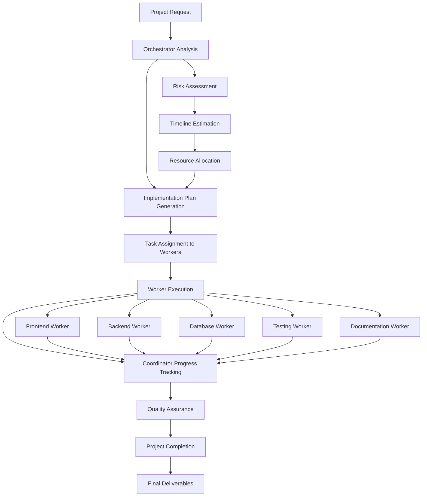

# Orchestrator-Worker Agent Pattern

A sophisticated AI agent pattern built with AI SDK v5 that coordinates complex projects through specialized workers using strongly typed tools and the `Experimental_Agent` class, with efficient project management and deliverable tracking.

## Features

- **AI SDK v5 Integration**: Built with strongly typed tools using `UIToolInvocation` and `Experimental_Agent`
- **Orchestrator-Worker Pattern**: Coordinates complex projects through specialized workers
- **Project Management**: Comprehensive planning, task assignment, and progress tracking
- **Specialized Workers**: Frontend, backend, database, API, testing, documentation, research, design, and deployment workers
- **Real-Time Coordination**: Live progress updates and issue resolution with mandatory workflow controls
- **Deliverable Tracking**: Complete project lifecycle management with quality assurance
- **Streaming UI**: Real-time progress updates and tool execution feedback with Chain of Thought visualization
- **Error Handling**: Robust error handling with loading states
- **Type Safety**: Full TypeScript support with strongly typed tool invocations
- **Mandatory Workflow**: Enforced coordinator usage for proper project management

## Quick Start

```tsx
import { OrchestratorChatDemo } from "./components/orchestrator-chat-demo";

export default function Page() {
  return <OrchestratorChatDemo />;
}
```

## Architecture

### Core Components

1. **Agent Definition** (`lib/orchestrator-agent.ts`)
   - `Experimental_Agent` class with strongly typed tools
   - System prompts and stop conditions
   - Tool orchestration logic

2. **API Route** (`app/api/orchestrator-agent/route.ts`)
   - Simplified route using `orchestratorAgent.respond()`
   - Rate limiting and validation
   - Streaming response handling

3. **Demo Component** (`components/orchestrator-chat-demo.tsx`)
   - Interactive chat interface with `useChat`
   - Chain of Thought visualization
   - Project progress tracking

4. **Strongly Typed Tools** (`lib/ai-agent-orchestrator-tools/`)
   - Orchestrator tool for project planning using `UIToolInvocation`
   - Worker tool for specialized task execution
   - Coordinator tool for progress tracking and issue resolution

### Tool Workflow



## Tool Types

### 1. Orchestrator Tool

```typescript
export const orchestratorTool = tool({
  description:
    "Plan and coordinate complex tasks by breaking them down into manageable subtasks",
  inputSchema: z.object({
    request: z
      .string()
      .describe("The complex task or feature request to orchestrate"),
    context: z
      .string()
      .optional()
      .describe("Additional context about the project or requirements"),
    constraints: z
      .array(z.string())
      .optional()
      .describe("Any constraints or limitations to consider"),
    priority: z
      .enum(["low", "medium", "high", "urgent"])
      .default("medium")
      .describe("Overall priority of the task"),
  }),
  async *execute({ request, context, constraints, priority }) {
    yield { state: "loading" as const };

    // Generate implementation plan with 6 standard phases
    const implementationPlan = {
      request,
      context: context || "No additional context provided",
      constraints: constraints || [],
      priority,
      items: [
        {
          purpose: "Research and analyze requirements",
          category: "research" as const,
          deliverable:
            "Requirements analysis document with technical specifications",
          priority: "high" as const,
          estimatedComplexity: "medium" as const,
          dependencies: [],
          estimatedDuration: "1-2 hours",
        },
        // ... 5 more items for design, development, testing, deployment, documentation
      ],
      estimatedDuration: "8-12 hours total",
      riskLevel: "medium",
      successCriteria: [
        "All requirements are met and validated",
        "System follows architectural best practices",
        "Comprehensive test coverage (>80%)",
        "Application is deployed and accessible",
        "Documentation is complete and user-friendly",
      ],
    };

    yield { state: "ready" as const, plan: implementationPlan };
  },
});

export type OrchestratorUIToolInvocation = {
  state:
    | "loading"
    | "ready"
    | "input-streaming"
    | "input-available"
    | "output-available"
    | "output-error";
  input?: {
    request: string;
    context?: string;
    constraints?: string[];
    priority: "low" | "medium" | "high" | "urgent";
  };
  output?: {
    state: "loading" | "ready";
    plan?: {
      request: string;
      context: string;
      constraints: string[];
      priority: string;
      items: Array<{
        purpose: string;
        category:
          | "research"
          | "design"
          | "development"
          | "testing"
          | "deployment"
          | "documentation";
        deliverable: string;
        priority: "low" | "medium" | "high";
        estimatedComplexity: "low" | "medium" | "high";
        dependencies?: string[];
        estimatedDuration: string;
      }>;
      estimatedDuration: string;
      riskLevel: string;
      successCriteria: string[];
    };
  };
  errorText?: string;
};
```

### 2. Worker Tool

```typescript
export const workerTool = tool({
  description:
    "Execute specialized tasks assigned by the orchestrator with domain-specific expertise",
  inputSchema: z.object({
    taskId: z.string().describe("Unique identifier for this task"),
    workerType: z
      .enum([
        "frontend",
        "backend",
        "database",
        "api",
        "testing",
        "documentation",
        "research",
        "design",
        "deployment",
      ])
      .describe("Type of worker needed for this task"),
    description: z
      .string()
      .describe("Detailed description of the task to be performed"),
    requirements: z
      .array(z.string())
      .describe("Specific requirements and constraints for this task"),
    context: z
      .string()
      .describe("Additional context about the project and dependencies"),
    expectedOutput: z
      .string()
      .describe("What the worker should produce as output"),
    priority: z
      .enum(["low", "medium", "high", "urgent"])
      .default("medium")
      .describe("Task priority"),
  }),
  async *execute({
    taskId,
    workerType,
    description,
    requirements,
    context,
    expectedOutput,
    priority,
  }) {
    yield { state: "loading" as const };

    // Simulate work execution based on worker type and priority
    const workDuration =
      priority === "urgent" ? 500 : priority === "high" ? 1000 : 1500;
    await new Promise((resolve) => setTimeout(resolve, workDuration));

    // Generate worker-specific output based on type
    const workerOutputs = {
      frontend: {
        output: `Frontend implementation completed for task: ${description}`,
        explanation: `Created responsive UI components using modern frameworks, implemented state management, and ensured accessibility compliance.`,
        deliverables: [
          {
            name: "Component Library",
            type: "code" as const,
            content:
              "React components with TypeScript, styled with Tailwind CSS",
            status: "completed" as const,
          },
          // ... more deliverables
        ],
        issues: [],
        suggestions: [
          "Consider adding dark mode support",
          "Implement progressive web app features",
        ],
      },
      // ... similar patterns for other worker types
    };

    const result = workerOutputs[workerType] || {
      output: `Generic work completed for task: ${description}`,
      explanation: `Completed the assigned task with general expertise.`,
      deliverables: [],
      issues: [],
      suggestions: [],
    };

    const workerResult = {
      taskId,
      status: "completed" as const,
      ...result,
    };

    yield { state: "ready" as const, result: workerResult };
  },
});

export type WorkerUIToolInvocation = {
  state:
    | "loading"
    | "ready"
    | "input-streaming"
    | "input-available"
    | "output-available"
    | "output-error";
  input?: {
    taskId: string;
    workerType:
      | "frontend"
      | "backend"
      | "database"
      | "api"
      | "testing"
      | "documentation"
      | "research"
      | "design"
      | "deployment";
    description: string;
    requirements: string[];
    context: string;
    expectedOutput: string;
    priority: "low" | "medium" | "high" | "urgent";
  };
  output?: {
    state: "loading" | "ready";
    result?: {
      taskId: string;
      status: "completed" | "failed" | "needs_review";
      output: string;
      explanation: string;
      deliverables?: Array<{
        name: string;
        type:
          | "code"
          | "documentation"
          | "design"
          | "analysis"
          | "test"
          | "configuration";
        content: string;
        status: "draft" | "review" | "approved" | "completed";
      }>;
      issues?: string[];
      suggestions?: string[];
    };
  };
  errorText?: string;
};
```

### 3. Coordinator Tool

```typescript
export const coordinatorTool = tool({
  description:
    "MANDATORY tool for managing the orchestration process. Use 'start' after planning, 'check_progress' after every 2-3 worker tasks, 'resolve_blocker' when tasks fail, and 'complete' when all tasks are finished. Essential for tracking progress and managing dependencies.",
  inputSchema: z.object({
    planId: z.string().describe("Unique identifier for the orchestration plan"),
    action: z
      .enum([
        "start",
        "check_progress",
        "resolve_blocker",
        "complete",
        "pause",
        "resume",
      ])
      .describe("Action to perform in the orchestration process"),
    context: z
      .string()
      .optional()
      .describe("Additional context for the action"),
    taskResults: z
      .array(
        z.object({
          taskId: z.string(),
          status: z.enum(["completed", "failed", "in_progress", "blocked"]),
          output: z.string().optional(),
        }),
      )
      .optional()
      .describe("Results from completed tasks"),
  }),
  async *execute({ planId, action, context, taskResults }) {
    yield { state: "loading" as const };

    // Simulate coordination work
    await new Promise((resolve) => setTimeout(resolve, 800));

    let coordinationResult;

    switch (action) {
      case "start":
        coordinationResult = {
          status: "orchestration_started",
          message: "Orchestration process has been initiated",
          nextSteps: [
            "Review the implementation plan",
            "Assign tasks to appropriate workers",
            "Begin execution of high-priority tasks",
          ],
          currentPhase: "initialization",
          estimatedCompletion: "8-12 hours",
        };
        break;

      case "check_progress":
        const completedTasks =
          taskResults?.filter((t) => t.status === "completed").length || 0;
        const totalTasks = 6; // Based on our implementation plan
        const progress = Math.round((completedTasks / totalTasks) * 100);

        coordinationResult = {
          status: "progress_checked",
          message: `Orchestration progress: ${progress}% complete`,
          progress: {
            completed: completedTasks,
            total: totalTasks,
            percentage: progress,
          },
          currentPhase:
            progress < 30
              ? "early_stage"
              : progress < 70
                ? "active_development"
                : "finalization",
          nextSteps:
            progress < 50
              ? ["Continue with high-priority tasks", "Monitor for blockers"]
              : [
                  "Focus on testing and quality assurance",
                  "Prepare for deployment",
                ],
          blockers:
            taskResults
              ?.filter((t) => t.status === "blocked")
              .map((t) => t.taskId) || [],
        };
        break;

      // ... other cases for resolve_blocker, complete, pause, resume
    }

    yield { state: "ready" as const, coordination: coordinationResult };
  },
});

export type CoordinatorUIToolInvocation = {
  state:
    | "loading"
    | "ready"
    | "input-streaming"
    | "input-available"
    | "output-available"
    | "output-error";
  input?: {
    planId: string;
    action:
      | "start"
      | "check_progress"
      | "resolve_blocker"
      | "complete"
      | "pause"
      | "resume";
    context?: string;
    taskResults?: Array<{
      taskId: string;
      status: "completed" | "failed" | "in_progress" | "blocked";
      output?: string;
    }>;
  };
  output?: {
    state: "loading" | "ready";
    coordination?: {
      status: string;
      message: string;
      nextSteps?: string[];
      currentPhase?: string;
      estimatedCompletion?: string;
      progress?: {
        completed: number;
        total: number;
        percentage: number;
      };
      blockers?: string[];
      resolution?: {
        action: string;
        timeline: string;
        impact: string;
      };
      summary?: {
        totalTasks: number;
        completedTasks: number;
        failedTasks: number;
        overallStatus: "in_progress" | "completed" | "failed" | "needs_review";
        qualityScore: number;
        nextSteps: string[];
      };
      deliverables?: string[];
    };
  };
  errorText?: string;
};
```

## Project Management Features

The agent provides comprehensive project management capabilities:

- **Implementation Planning**: Detailed project breakdown with tasks, dependencies, and timelines
- **Worker Specialization**: Assign tasks to appropriate workers based on expertise
- **Progress Tracking**: Real-time monitoring of project progress and deliverables
- **Issue Resolution**: Automatic detection and resolution of project blockers
- **Quality Assurance**: Comprehensive review and validation of all deliverables

### Project Planning Example

```tsx
<OrchestratorView invocation={orchestratorInvocation}>
  <div className="space-y-4">
    <h3>Project Overview</h3>
    <p>{plan.request}</p>

    <div className="grid gap-3">
      {plan.items.map((item, index) => (
        <div key={index} className="p-4 border rounded-lg">
          <h4>{item.purpose}</h4>
          <div className="flex gap-2">
            <Badge variant="outline">{item.category}</Badge>
            <Badge variant="outline">{item.priority}</Badge>
            <Badge variant="outline">{item.estimatedComplexity}</Badge>
          </div>
          <p>{item.deliverable}</p>
          <p className="text-sm text-gray-600">
            Duration: {item.estimatedDuration}
          </p>
        </div>
      ))}
    </div>
  </div>
</OrchestratorView>
```

## Project Management Rules

The agent follows these mandatory project management guidelines:

- **Always start with orchestrator** for comprehensive planning
- **MANDATORY**: Use coordinator tool with "start" action after planning
- **Assign appropriate worker types** based on task requirements
- **MANDATORY**: Use coordinator tool with "check_progress" after every 2-3 worker tasks
- **MANDATORY**: Use coordinator tool with "resolve_blocker" if any worker task fails
- **MANDATORY**: Use coordinator tool with "complete" action when all tasks are finished
- **Simple Projects**: 2-3 tool calls maximum (orchestrator → coordinator start → worker → coordinator complete)
- **Complex Projects**: Up to 15 tool calls with multiple workers and mandatory coordinator checkpoints

## Example Usage

### Simple Project

**Input**: "Create a simple login form"

**Process**:

1. **Orchestrator** creates implementation plan (research, design, development, testing, deployment, documentation)
2. **Coordinator** with "start" action initiates the process
3. **Frontend worker** implements the form components
4. **Coordinator** with "check_progress" monitors completion
5. **Coordinator** with "complete" action finalizes the project

**Output**: Complete login form with validation and styling

### Complex Project

**Input**: "Build a full-stack e-commerce platform"

**Process**:

1. **Orchestrator** creates comprehensive implementation plan with 6 phases
2. **Coordinator** with "start" action initiates the process
3. **Research worker** analyzes requirements and market research
4. **Design worker** creates system architecture and UX flows
5. **Coordinator** with "check_progress" after 2 tasks
6. **Frontend worker** implements UI components and user interface
7. **Backend worker** develops API endpoints and business logic
8. **Database worker** designs data models and migrations
9. **Coordinator** with "check_progress" after 2 more tasks
10. **Testing worker** creates unit and integration tests
11. **Documentation worker** writes user guides and API docs
12. **Coordinator** with "complete" action finalizes the project

**Output**: Complete e-commerce platform with all features and documentation

## Configuration

### Environment Variables

```bash
# Required for AI model
OPENAI_API_KEY=your_openai_api_key

# Optional: Rate limiting
RATE_LIMIT_MAX_REQUESTS=10
RATE_LIMIT_WINDOW_MS=60000
```

### Customization

You can customize the agent behavior by modifying:

1. **System Prompt** (in `orchestrator-agent.ts`)
2. **Tool Definitions** (in the API route)
3. **Worker Types** (in `schema.ts`)
4. **UI Components** (in the demo component)

## API Reference

### POST `/api/orchestrator-agent`

**Request Body**:

```typescript
{
  messages: UIMessage[];
}
```

**Response**: Streaming UIMessage with tool execution and project progress

### Message Types

```typescript
// Agent definition with strongly typed tools
export const orchestratorAgent = new Agent({
  model: openai("gpt-4.1-mini"),
  system: `You are an Orchestrator-Worker Agent that excels at coordinating complex projects through specialized workers.

## Your Role
You are a senior project manager and technical architect who can:
1. **Orchestrate**: Break down complex requests into manageable tasks
2. **Coordinate**: Manage dependencies and track progress across multiple workers
3. **Delegate**: Assign specialized tasks to appropriate workers based on their expertise

## Available Workers
- **Research Worker**: Analyzes requirements, conducts market research, and provides technical specifications
- **Design Worker**: Creates UX flows, system architecture, and visual mockups
- **Frontend Worker**: Implements user interfaces, components, and client-side functionality
- **Backend Worker**: Develops APIs, services, and server-side logic
- **Database Worker**: Designs schemas, optimizes queries, and manages data
- **API Worker**: Integrates external services and manages API connections
- **Testing Worker**: Creates comprehensive test suites and ensures quality
- **Documentation Worker**: Writes user guides, API docs, and technical documentation
- **Deployment Worker**: Sets up CI/CD, configures infrastructure, and manages releases

## Workflow
1. **Plan**: Use the orchestrator tool to break down the request into tasks
2. **Start**: Use the coordinator tool with action "start" to initiate the process
3. **Execute**: Use the worker tool to assign and execute specialized tasks
4. **Monitor**: After every 2-3 worker tasks, use the coordinator tool with action "check_progress"
5. **Resolve**: If any worker task fails or is blocked, use the coordinator tool with action "resolve_blocker"
6. **Complete**: When all tasks are done, use the coordinator tool with action "complete"

## Guidelines
- Always start with orchestration to create a comprehensive plan
- **MANDATORY**: Use coordinator tool with "start" action after planning
- Assign tasks to workers based on their specialized expertise
- **MANDATORY**: Use coordinator tool with "check_progress" after every 2-3 worker tasks
- **MANDATORY**: Use coordinator tool with "resolve_blocker" if any worker task fails
- **MANDATORY**: Use coordinator tool with "complete" action when all tasks are finished
- Provide clear, actionable feedback and next steps
- Ensure all deliverables meet quality standards
- Communicate progress and any issues clearly to the user

## Coordinator Usage Rules
- **Always** use coordinator "start" after orchestrator planning
- **Always** use coordinator "check_progress" after 2-3 worker tasks
- **Always** use coordinator "resolve_blocker" when worker tasks fail
- **Always** use coordinator "complete" when all tasks are finished
- Pass task results to coordinator when available for accurate progress tracking`,
  tools: {
    orchestrator: orchestratorTool,
    worker: workerTool,
    coordinator: coordinatorTool,
  },
  stopWhen: stepCountIs(15),
});

// Infer UI message type from agent
export type OrchestratorAgentUIMessage =
  typeof orchestratorAgent extends Agent<infer T> ? T : never;

// Individual tool invocation types
export type OrchestratorUIToolInvocation = {
  state:
    | "loading"
    | "ready"
    | "input-streaming"
    | "input-available"
    | "output-available"
    | "output-error";
  input?: {
    request: string;
    context?: string;
    constraints?: string[];
    priority: "low" | "medium" | "high" | "urgent";
  };
  output?: {
    state: "loading" | "ready";
    plan?: {
      request: string;
      context: string;
      constraints: string[];
      priority: string;
      items: Array<{
        purpose: string;
        category:
          | "research"
          | "design"
          | "development"
          | "testing"
          | "deployment"
          | "documentation";
        deliverable: string;
        priority: "low" | "medium" | "high";
        estimatedComplexity: "low" | "medium" | "high";
        dependencies?: string[];
        estimatedDuration: string;
      }>;
      estimatedDuration: string;
      riskLevel: string;
      successCriteria: string[];
    };
  };
  errorText?: string;
};

export type WorkerUIToolInvocation = {
  state:
    | "loading"
    | "ready"
    | "input-streaming"
    | "input-available"
    | "output-available"
    | "output-error";
  input?: {
    taskId: string;
    workerType:
      | "frontend"
      | "backend"
      | "database"
      | "api"
      | "testing"
      | "documentation"
      | "research"
      | "design"
      | "deployment";
    description: string;
    requirements: string[];
    context: string;
    expectedOutput: string;
    priority: "low" | "medium" | "high" | "urgent";
  };
  output?: {
    state: "loading" | "ready";
    result?: {
      taskId: string;
      status: "completed" | "failed" | "needs_review";
      output: string;
      explanation: string;
      deliverables?: Array<{
        name: string;
        type:
          | "code"
          | "documentation"
          | "design"
          | "analysis"
          | "test"
          | "configuration";
        content: string;
        status: "draft" | "review" | "approved" | "completed";
      }>;
      issues?: string[];
      suggestions?: string[];
    };
  };
  errorText?: string;
};

export type CoordinatorUIToolInvocation = {
  state:
    | "loading"
    | "ready"
    | "input-streaming"
    | "input-available"
    | "output-available"
    | "output-error";
  input?: {
    planId: string;
    action:
      | "start"
      | "check_progress"
      | "resolve_blocker"
      | "complete"
      | "pause"
      | "resume";
    context?: string;
    taskResults?: Array<{
      taskId: string;
      status: "completed" | "failed" | "in_progress" | "blocked";
      output?: string;
    }>;
  };
  output?: {
    state: "loading" | "ready";
    coordination?: {
      status: string;
      message: string;
      nextSteps?: string[];
      currentPhase?: string;
      estimatedCompletion?: string;
      progress?: {
        completed: number;
        total: number;
        percentage: number;
      };
      blockers?: string[];
      resolution?: {
        action: string;
        timeline: string;
        impact: string;
      };
      summary?: {
        totalTasks: number;
        completedTasks: number;
        failedTasks: number;
        overallStatus: "in_progress" | "completed" | "failed" | "needs_review";
        qualityScore: number;
        nextSteps: string[];
      };
      deliverables?: string[];
    };
  };
  errorText?: string;
};
```

## Error Handling

The component includes comprehensive error handling:

- **Loading States**: Shows progress during tool execution
- **Error Boundaries**: Graceful fallbacks for failed operations
- **Null Checks**: Prevents crashes from undefined data
- **Rate Limiting**: Prevents API abuse
- **Worker Failures**: Automatic retry and fallback mechanisms

## Performance

- **Efficient Project Management**: Optimized task assignment and execution
- **Streaming Responses**: Real-time updates for better UX
- **Parallel Execution**: Multiple workers can execute tasks simultaneously
- **Error Recovery**: Graceful handling of worker failures and project blockers

## Dependencies

```json
{
  "ai": "^5.0.0",
  "@ai-sdk/react": "^1.0.0",
  "@ai-sdk/openai": "^1.0.0",
  "zod": "^4.0.0",
  "lucide-react": "^0.400.0"
}
```

## License

MIT License - see LICENSE file for details.

## Contributing

1. Fork the repository
2. Create a feature branch
3. Make your changes
4. Add tests if applicable
5. Submit a pull request

## Support

For issues and questions:

- Create an issue in the repository
- Check the documentation
- Review the example implementations
