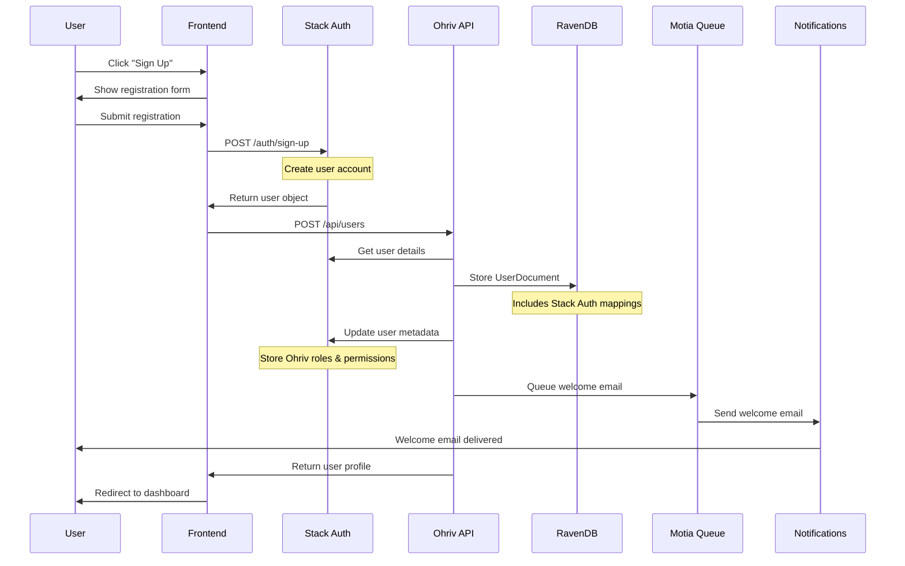
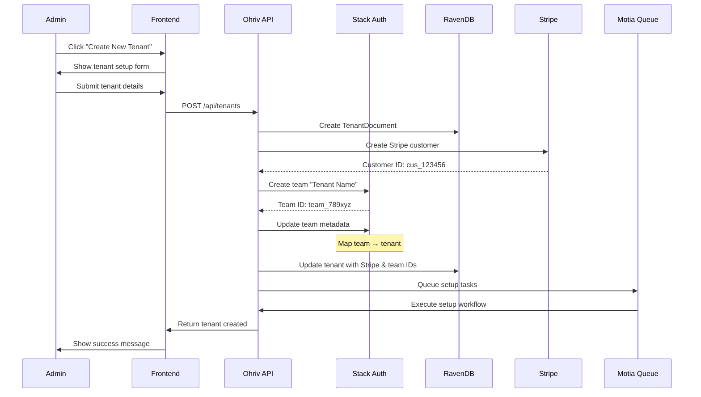
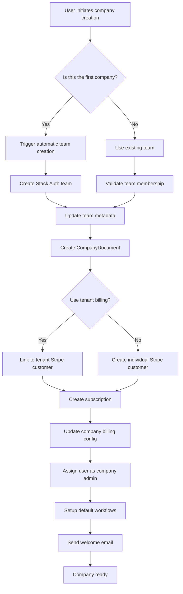
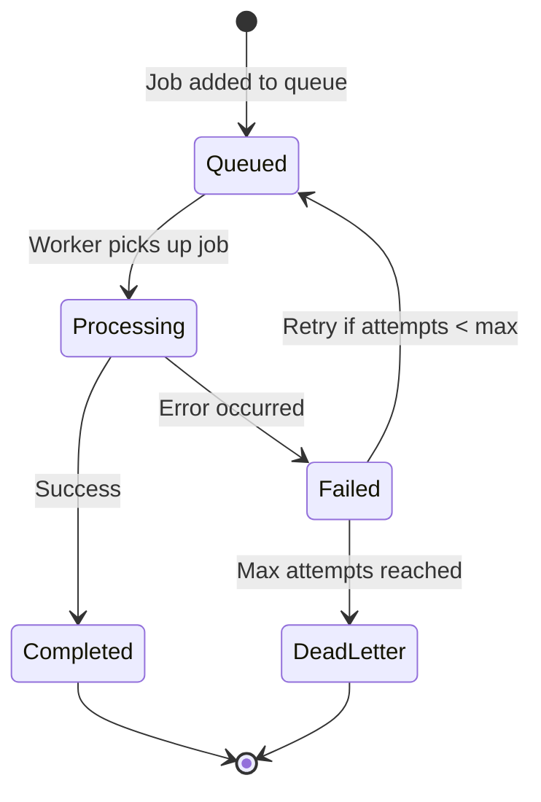
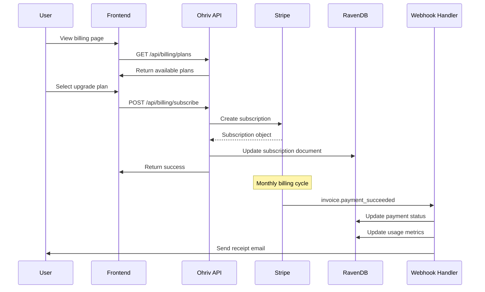
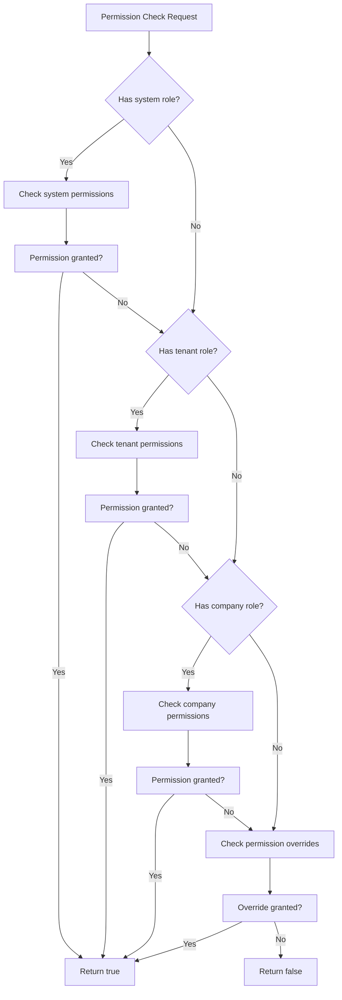

# 🔄 Backend Flow Visualization
## Stack Auth × RavenDB × Stripe Integration

---

## 📋 Table of Contents

1. [User Registration Flow](#1-user-registration-flow)
2. [Tenant Creation Flow](#2-tenant-creation-flow)
3. [Company Setup Flow](#3-company-setup-flow)
4. [Automatic Team Creation](#4-automatic-team-creation)
5. [Billing & Subscription Flow](#5-billing--subscription-flow)
6. [Permission Resolution Flow](#6-permission-resolution-flow)
7. [Error Handling & Retry Logic](#7-error-handling--retry-logic)

---

## 1. User Registration Flow

### **Flow Diagram**



### **Detailed Steps**

1. **Frontend Initiation**
   ```typescript
   // User submits registration form
   const registrationData = {
     email: "sarah@andela.com",
     password: "securePassword123",
     name: "Sarah Chen",
     tenantId: "tenant-andela", // If joining existing tenant
     role: "recruiter"
   };
   ```

2. **Stack Auth User Creation**
   ```typescript
   // Stack Auth API call
   const stackAuthUser = await stackAuthClient.signUp({
     email: registrationData.email,
     password: registrationData.password,
     displayName: registrationData.name
   });
   ```

3. **Ohriv User Document Creation**
   ```typescript
   const userDocument: UserDocument = {
     id: `users/${generateId()}`,
     userId: generateId(),
     email: registrationData.email,
     name: registrationData.name,
     stackAuthUserId: stackAuthUser.id,
     stackAuthTeamId: teamId,
     primaryTenantId: registrationData.tenantId,
     status: UserStatus.Active,
     createdAt: new Date().toISOString(),
     // ... other fields
   };
   ```

4. **Metadata Synchronization**
   ```typescript
   // Update Stack Auth user metadata
   await stackAuth.updateUser(stackAuthUser.id, {
     serverMetadata: {
       ohrivTenantRole: "tenant:user",
       ohrivCompanyRoles: [],
       preferences: {
         theme: "light",
         emailNotifications: true
       }
     }
   });
   ```

---

## 2. Tenant Creation Flow

### **Flow Diagram**



### **Detailed Implementation**

1. **Tenant Creation Request**
   ```typescript
   interface CreateTenantRequest {
     name: string;                    // "Andela Talent Solutions"
     mode: "staffing_agency" | "single_company";
     ownerEmail: string;              // "ceo@andela.com"
     ownerName: string;               // "Sarah Chen"
     plan: "starter" | "professional" | "enterprise";
     billing: {
       paymentMethodId: string;       // Stripe payment method ID
     };
   }
   ```

2. **Parallel Operations**
   ```typescript
   // Execute operations in parallel for efficiency
   const [tenantId, stripeCustomer, stackAuthTeam] = await Promise.all([
     // 1. Generate tenant ID
     Promise.resolve(generateTenantId(request.name)),

     // 2. Create Stripe customer
     stripe.customers.create({
       email: request.ownerEmail,
       name: request.ownerName,
       metadata: { tenantType: request.mode }
     }),

     // 3. Create Stack Auth team
     stackAuth.createTeam({
       name: request.name,
       displayName: request.name
     })
   ]);
   ```

3. **Team Metadata Configuration**
   ```typescript
   await stackAuth.updateTeam(stackAuthTeam.id, {
     serverMetadata: {
       ohrivTenantId: tenantId,
       tenantMode: request.mode,
       maxCompanies: getMaxCompaniesForPlan(request.plan),
       settings: {
         allowCrossCompanyAccess: request.mode === "staffing_agency",
         defaultPermissions: getDefaultPermissions(request.plan)
       }
     }
   });
   ```

4. **Setup Workflow Queue**
   ```typescript
   await queue.add('tenant-setup', {
     tenantId,
     ownerEmail: request.ownerEmail,
     plan: request.plan,
     stripeCustomerId: stripeCustomer.id,
     stackAuthTeamId: stackAuthTeam.id
   }, {
     delay: 1000, // 1 second delay
     attempts: 3,
     backoff: 'exponential'
   });
   ```

---

## 3. Company Setup Flow

### **Flow Diagram**



### **Code Implementation**

```typescript
class CompanySetupService {
  async createCompany(data: CreateCompanyRequest): Promise<CompanyDocument> {
    // 1. Check if this is the first company for the tenant
    const isFirstCompany = await this.isFirstCompany(data.tenantId);

    let stackAuthTeamId: string;

    if (isFirstCompany) {
      // 2. Trigger automatic team creation
      stackAuthTeamId = await this.queueTeamCreation({
        tenantId: data.tenantId,
        teamName: data.name,
        requestedBy: data.requestedBy
      });
    } else {
      // 3. Use existing team
      const tenant = await this.tenantService.getTenant(data.tenantId);
      stackAuthTeamId = tenant.stackAuthTeamId;
    }

    // 4. Create company document
    const company = await this.db.store<CompanyDocument>({
      id: `companies/${generateId()}`,
      collection: "companies",
      companyId: generateCompanyId(data.name),
      name: data.name,
      tenantId: data.tenantId,
      stackAuthTeamId,
      // ... other fields
    });

    // 5. Setup billing
    if (data.billing.useTenantBilling) {
      await this.linkToTenantBilling(company.id, data.tenantId);
    } else {
      await this.setupIndividualBilling(company.id, data.billing);
    }

    // 6. Assign user as admin
    await this.permissionService.assignRole(
      data.requestedBy,
      "company:admin",
      company.id
    );

    return company;
  }
}
```

---

## 4. Automatic Team Creation

### **Queue Processing Flow**



### **Implementation Details**

```typescript
interface TeamCreationJob {
  id: string;
  data: {
    tenantId: string;
    teamName: string;
    requestedBy: string;
    requestedAt: string;
  };
  attempts: number;
  status: "pending" | "processing" | "completed" | "failed";
}

class TeamCreationWorker {
  async process(job: TeamCreationJob): Promise<void> {
    try {
      // 1. Update job status to processing
      await this.updateJobStatus(job.id, "processing");

      // 2. Get tenant details
      const tenant = await this.tenantService.getTenant(job.data.tenantId);

      // 3. Create team in Stack Auth
      const team = await this.stackAuth.createTeam({
        name: job.data.teamName,
        displayName: job.data.teamName
      });

      // 4. Configure team metadata
      await this.stackAuth.updateTeam(team.id, {
        serverMetadata: {
          ohrivTenantId: job.data.tenantId,
          tenantMode: tenant.mode,
          maxCompanies: tenant.limits.maxCompanies,
          settings: tenant.settings
        }
      });

      // 5. Update tenant with team ID
      await this.tenantService.updateTenant(job.data.tenantId, {
        stackAuthTeamId: team.id
      });

      // 6. Mark job as completed
      await this.updateJobStatus(job.id, "completed", {
        stackAuthTeamId: team.id,
        completedAt: new Date().toISOString()
      });

      // 7. Notify requester
      await this.notifyTeamCreated(job.data.requestedBy, team.id);

    } catch (error) {
      // Handle error
      await this.handleError(job, error);
    }
  }

  private async handleError(job: TeamCreationJob, error: Error): Promise<void> {
    const maxRetries = 3;

    if (job.attempts < maxRetries) {
      // Schedule retry with exponential backoff
      const delay = Math.pow(2, job.attempts) * 1000; // 1s, 2s, 4s

      await this.queue.add('team-creation', job.data, {
        delay,
        attempts: job.attempts + 1
      });

      await this.updateJobStatus(job.id, "failed", {
        error: error.message,
        nextRetryAt: new Date(Date.now() + delay).toISOString()
      });
    } else {
      // Max retries reached - move to dead letter queue
      await this.queue.add('team-creation-dead-letter', {
        job,
        error: error.message,
        failedAt: new Date().toISOString()
      });

      await this.updateJobStatus(job.id, "failed", {
        error: error.message,
        movedToDeadLetter: true
      });

      // Notify admin of failure
      await this.notifyTeamCreationFailure(job.data.requestedBy, error);
    }
  }
}
```

---

## 5. Billing & Subscription Flow

### **Subscription Management**



### **Webhook Event Processing**

```typescript
class StripeWebhookHandler {
  async handleInvoicePaymentSucceeded(event: Stripe.Event): Promise<void> {
    const invoice = event.data.object as Stripe.Invoice;

    // 1. Find customer in our database
    const customer = await this.billingService.getCustomerByStripeId(
      invoice.customer as string
    );

    // 2. Create or update invoice document
    await this.billingService.createOrUpdateInvoice({
      stripeInvoiceId: invoice.id,
      customerId: customer.id,
      total: invoice.total,
      status: "paid",
      paidAt: new Date(invoice.status_transitions.paid_at * 1000).toISOString()
    });

    // 3. Update subscription status
    if (invoice.subscription) {
      await this.billingService.updateSubscriptionStatus(
        invoice.subscription as string,
        "active"
      );
    }

    // 4. Update tenant/company access
    await this.updateAccessBasedOnPayment(customer.id);

    // 5. Send receipt
    await this.notificationService.sendPaymentReceipt(
      customer.id,
      invoice
    );
  }
}
```

---

## 6. Permission Resolution Flow

### **Permission Check Process**



### **Implementation**

```typescript
class PermissionResolver {
  async hasPermission(
    userId: string,
    permission: string,
    context?: PermissionContext
  ): Promise<boolean> {
    // 1. Get user from Stack Auth
    const stackAuthUser = await this.stackAuth.getUser(userId);

    // 2. Get user metadata
    const metadata = stackAuthUser.serverMetadata;

    // 3. Check system permissions (highest priority)
    if (metadata.ohrivSystemRole) {
      const systemPerms = this.getSystemRolePermissions(
        metadata.ohrivSystemRole
      );
      if (this.matchesPermission(systemPerms, permission)) {
        return true;
      }
    }

    // 4. Check tenant permissions
    if (metadata.ohrivTenantRole && context?.tenantId) {
      const tenantPerms = this.getTenantRolePermissions(
        metadata.ohrivTenantRole,
        context.tenantId
      );
      if (this.matchesPermission(tenantPerms, permission)) {
        return true;
      }
    }

    // 5. Check company-specific permissions
    if (metadata.ohrivCompanyRoles && context?.companyId) {
      const companyRole = metadata.ohrivCompanyRoles.find(
        cr => cr.companyId === context.companyId
      );

      if (companyRole) {
        const companyPerms = this.getCompanyRolePermissions(
          companyRole.role,
          context.companyId
        );
        if (this.matchesPermission(companyPerms, permission)) {
          return true;
        }
      }
    }

    // 6. Check permission overrides
    const overrides = metadata.permissionOverrides || [];
    const override = overrides.find(po => po.permission === permission);

    if (override) {
      // Check if override is still valid
      if (!override.expiresAt || new Date(override.expiresAt) > new Date()) {
        return override.granted;
      }
    }

    // 7. Permission denied
    await this.trackPermissionCheck(userId, permission, false, context);
    return false;
  }

  private matchesPermission(
    permissions: string[],
    requested: string
  ): boolean {
    // Exact match
    if (permissions.includes(requested)) {
      return true;
    }

    // Wildcard matching
    const [resource, action, scope] = requested.split(':');

    // Check resource wildcards
    if (permissions.includes(`${resource}:*`)) {
      return true;
    }

    // Check resource:action wildcards
    if (permissions.includes(`${resource}:${action}:*`)) {
      return true;
    }

    // Check all permissions wildcard
    if (permissions.includes('*')) {
      return true;
    }

    return false;
  }
}
```

---

## 7. Error Handling & Retry Logic

### **Global Error Handler**

```typescript
class GlobalErrorHandler {
  async handleError(error: Error, context: ErrorContext): Promise<void> {
    // 1. Log error with context
    await this.logger.error(error.message, {
      stack: error.stack,
      context,
      timestamp: new Date().toISOString()
    });

    // 2. Categorize error
    const errorType = this.categorizeError(error);

    // 3. Handle based on type
    switch (errorType) {
      case 'STRIPE_ERROR':
        await this.handleStripeError(error, context);
        break;

      case 'STACK_AUTH_ERROR':
        await this.handleStackAuthError(error, context);
        break;

      case 'DATABASE_ERROR':
        await this.handleDatabaseError(error, context);
        break;

      case 'VALIDATION_ERROR':
        await this.handleValidationError(error, context);
        break;

      default:
        await this.handleUnknownError(error, context);
    }
  }

  private async handleStripeError(error: Error, context: ErrorContext): Promise<void> {
    // Check if it's a temporary failure
    if (this.isTemporaryStripeError(error)) {
      // Schedule retry
      await this.scheduleRetry(context, {
        delay: 5000, // 5 seconds
        maxRetries: 3
      });
    } else {
      // Notify billing team
      await this.notifyBillingTeam(error, context);
    }
  }
}
```

### **Circuit Breaker Pattern**

```typescript
class CircuitBreaker {
  private failures = 0;
  private lastFailureTime = 0;
  private state: 'CLOSED' | 'OPEN' | 'HALF_OPEN' = 'CLOSED';

  async execute<T>(
    operation: () => Promise<T>,
    options: CircuitBreakerOptions = {}
  ): Promise<T> {
    if (this.state === 'OPEN') {
      if (Date.now() - this.lastFailureTime > options.resetTimeout) {
        this.state = 'HALF_OPEN';
      } else {
        throw new Error('Circuit breaker is OPEN');
      }
    }

    try {
      const result = await operation();
      this.onSuccess();
      return result;
    } catch (error) {
      this.onFailure();
      throw error;
    }
  }

  private onSuccess(): void {
    this.failures = 0;
    this.state = 'CLOSED';
  }

  private onFailure(): void {
    this.failures++;
    this.lastFailureTime = Date.now();

    if (this.failures >= 5) { // Threshold
      this.state = 'OPEN';
    }
  }
}

// Usage example
const stripeCircuitBreaker = new CircuitBreaker();

await stripeCircuitBreaker.execute(async () => {
  return await stripe.customers.create(customerData);
}, {
  resetTimeout: 60000 // 1 minute
});
```

---

## Summary

This backend flow visualization demonstrates:

1. **Seamless User Registration**
   - Stack Auth integration for authentication
   - Automatic metadata synchronization
   - Welcome email automation

2. **Efficient Tenant Creation**
   - Parallel operations for speed
   - Team creation with proper metadata
   - Stripe customer setup

3. **Flexible Company Management**
   - Automatic team creation for first company
   - Individual billing options
   - Role-based access control

4. **Robust Error Handling**
   - Circuit breaker pattern
   - Retry logic with exponential backoff
   - Dead letter queues

5. **Real-time Permissions**
   - Metadata-based resolution
   - Hierarchical permission checking
   - Override support

The system is designed to be resilient, scalable, and maintainable, with proper separation of concerns and clear boundaries between services.