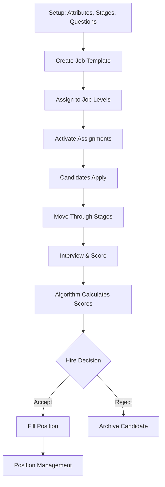

# OHRIV Platform: Comprehensive Technical Overview

**Version:** 1.0
**Last Updated:** 2025-01-23
**Compiled from:** Schema Analysis, Help Content, Types, and Business Logic

---

## Executive Summary

OHRIV is a sophisticated applicant tracking and candidate evaluation platform that uses **data-driven scoring algorithms** to objectively assess candidates across customizable evaluation criteria. The platform supports **hierarchical attribute systems**, **multi-stage interview workflows**, **job-level assignments**, **position management**, and **advanced scoring algorithms** including machine learning models.

---

## Table of Contents

1. [System Architecture](#system-architecture)
2. [Core Data Model](#core-data-model)
3. [Key Concepts](#key-concepts)
4. [Platform Workflow](#platform-workflow)
5. [Scoring System](#scoring-system)
6. [Algorithm System](#algorithm-system)
7. [Position Management](#position-management)
8. [Subscription & Billing](#subscription--billing)
9. [Technical Implementation](#technical-implementation)

---

## System Architecture

### Technology Stack

- **Framework:** Next.js 15 with App Router
- **Database:** PostgreSQL (via Prisma ORM)
- **Authentication:** Better Auth with multi-factor support
- **Payments:** Stripe integration with addon system
- **ML Execution:** AWS Lambda for Python-based algorithms (scikit-learn)
- **File Storage:** ImageKit for media management
- **Email:** Unsend for transactional emails

### Multi-Tenant Architecture

```
Platform
└── Organizations
    ├── Users (with role-based permissions)
    ├── Attributes (evaluation criteria)
    ├── Stages (interview phases)
    ├── Questions (interview questions)
    ├── Job Pool (reusable templates)
    │   └── Job Level Assignments
    │       └── Positions (filled roles)
    ├── Candidates
    └── Scoring Data
```

---

## Core Data Model

### Organization Hierarchy

**Organization** is the top-level entity with:
- Settings (setup wizard status, feature flags)
- Custom terminology (rename "Attributes" to "Competencies", etc.)
- Subscription management
- Team structure

**Membership** connects users to organizations with roles:
- `owner` - Full platform control
- `admin` - Manage settings and users
- `manager` - Create jobs and manage candidates
- `recruiter` - View and process candidates
- `interviewer` - Conduct interviews only

### Setup Wizard Flow

Organizations complete a guided setup:
1. **Stages:** Define interview phases (Screening → Technical → Final)
2. **Attributes:** Define evaluation criteria (Technical Skills, Communication, etc.)
3. **Questions:** Build interview question bank
4. **Jobs:** Create job templates and level assignments
5. **Candidates:** Begin processing applicants

---

## Key Concepts

### 1. Attributes (Customizable Terminology)

**What They Are:**
- Specific qualities, skills, or characteristics to measure in candidates
- Think: Technical Expertise, Critical Thinking, Team Collaboration, Customer Focus
- Organizations can rename to their preferred terminology (e.g., "Competencies", "Success Factors")

**Hierarchical Structure:**
```
Communication (Parent Attribute - 20% weight)
├── Written Communication (Sub-attribute)
├── Verbal Presentation (Sub-attribute)
└── Active Listening (Sub-attribute)
```

**Key Features:**
- **Parent attributes** receive weight assignments per job (must total 100%)
- **Sub-attributes** provide granular evaluation without affecting parent weight
- **Scoring:** Parent score = average of all scored sub-attributes
- **Questions** can be tagged with sub-attributes for precise assessment

**Business Logic:**
- Sub-attributes allow deeper granularity without weight dilution
- If "Communication" is weighted 20%, all its sub-attributes share that 20%
- Candidate reports show performance across both parent and sub-attributes

### 2. Interview Stages

**Purpose:**
Sequential phases candidates move through during the hiring process.

**Common Pattern:**
```
Screening → Phone Interview → Technical Assessment → Team Interview → Final Interview
```

**Features:**
- Each stage has specific questions assigned
- Candidates track through stages with status updates
- Scores collected per stage for historical tracking
- Two system-default stages: `Screening` (first) and `Final Interview` (last)

**Stage Properties:**
- `isSystemDefault`: Cannot be deleted or reordered
- `isDefault`: Created via "Create Default Stages" button
- `canDelete`: User-created stages can be removed
- `order`: Determines sequence (validated on update)

### 3. Interview Questions

**Structure:**
```typescript
{
  text: "Tell me about a time when...",
  description: "Context for interviewer",
  difficultyLevel: "Basic | Intermediate | Advanced | Expert",
  expectations: {
    answerCharacteristics: {
      poor: ["Red flag behaviors..."],
      average: ["Acceptable responses..."],
      great: ["Exceptional indicators..."]
    },
    followUpQuestions: [
      { question: "How did you...", whenToAsk: "If candidate mentions..." }
    ]
  },
  internalNotes: "Evaluation guidance for interviewers",
  categoryId: "Reference to QuestionCategory",
  stageId: "Which interview stage this belongs to",
  question_attribute: [] // Tags: which attributes this assesses
}
```

**Answer Characteristics System:**
- Replaced old `keyPoints` / `redFlags` approach
- Three-tier evaluation: Poor / Average / Great
- Helps interviewers standardize scoring
- Provides objective assessment criteria

**Attribute Tagging:**
- Each question tagged with 1-3 attributes it evaluates
- When candidate answers well → earn points in those attributes
- Ensures comprehensive attribute coverage across interview

**Quality Requirements:**
- Each attribute must be assessed at least once per stage
- Platform audits for coverage gaps
- Prevents incomplete evaluations

### 4. Job Pool System

**Revolutionary Design:**
Instead of creating "Junior Developer", "Mid Developer", "Senior Developer" separately, you create ONE "Developer" template and assign it to multiple levels.

**Job Template (In Pool):**
```typescript
{
  title: "Software Developer",
  baseDescription: "Core role description",
  baseRequirements: "Fundamental qualifications",
  status: "Draft | Active | Archived",
  tags: ["Engineering", "Remote-Friendly"],

  // Configuration (inherited by all level assignments)
  stages: [Screening, Technical, Team, Final],
  questions: [...], // Per stage
  attributeWeights: {
    "Technical Expertise": 40,
    "Problem Solving": 30,
    "Communication": 20,
    "Teamwork": 10
    // Must total 100%
  }
}
```

**Job Level Assignment:**
```typescript
{
  jobId: "developer-template-id",
  jobLevelId: "senior-level-id",

  // Level-specific overrides
  customTitle: "Senior Software Developer",
  customDescription: "Leadership expectations...",
  customRequirements: "5+ years experience...",
  positionsAvailable: 3, // Hiring for 3 senior positions

  isActive: true, // Can pause hiring without deleting

  // Inherited from template:
  // - stages, questions, attributeWeights
}
```

**Workflow:**
1. Create job templates in Job Pool (reusable, generic)
2. Define organizational job levels (Junior, Mid, Senior, etc.)
3. Assign job templates to levels with customizations
4. Candidates apply to specific Job-Level Assignment combinations
5. Positions are created when candidates are hired

**Benefits:**
- **DRY Principle:** Create once, use many times
- **Consistency:** Update template → affects all assignments
- **Flexibility:** Level-specific customizations where needed
- **Scalability:** Easy to open/close positions per level

### 5. Job Levels

**Definition:**
Seniority or experience tiers within an organization (e.g., Entry, Mid, Senior, Lead, Principal).

**Properties:**
```typescript
{
  name: "Senior",
  description: "5-8 years experience, leads projects",
  order: 3, // For sorting
  organizationId: "..."
}
```

**Usage:**
- Organization defines their level structure once
- Jobs are assigned to levels with level-specific requirements
- Candidates are evaluated against level expectations

---

## Platform Workflow

### Complete Hiring Lifecycle



### Detailed Flow

#### 1. **Organization Setup**
- Admin completes setup wizard
- Defines attributes with hierarchy
- Creates interview stages
- Builds question bank
- Sets custom terminology

#### 2. **Job Configuration**
- Create job template in pool
- Define base description and requirements
- Assign attribute weights (must total 100%)
- Select interview stages
- Assign questions to each stage
- Set team members/owners

#### 3. **Level Assignment**
- Select job template
- Choose one or more job levels
- Customize title per level
- Add level-specific requirements
- Set positions available
- Activate assignment

#### 4. **Candidate Journey**
- Candidate applies to Job-Level Assignment
- Assigned to `currentStageId` (usually "Screening")
- Moves through stages sequentially
- Interviewers ask stage-specific questions
- Responses scored against attributes

#### 5. **Evaluation & Scoring**
- **Per Question:** Interviewer scores based on answer characteristics
- **Per Attribute:** Aggregates scores from all related questions
- **Sub-Attributes:** If applicable, parent score = avg(sub-attribute scores)
- **Weighted Total:** Final score = Σ(attribute_score × attribute_weight)

#### 6. **Hiring Decision**
- Review candidate scores and notes
- Compare candidates objectively via weighted scores
- **Accept:** Create Position (fills a slot from `positionsAvailable`)
- **Reject:** Archive candidate with reason

#### 7. **Position Management**
- Position created when candidate hired
- Tracks: employment type, work schedule, remote status, location
- Position statuses:
  - `FILLED` - Active employee
  - `ON_HOLD` - Paused/waiting
  - `REMOVED` - Terminated/rejected
- Links to JobLevelAssignment and Candidate

---

## Scoring System

### Hierarchical Attribute Scoring

**Core Principle:**
Only **parent attributes** receive weights. Sub-attributes inherit proportionally.

**Calculation Logic:**

```typescript
// For parent attribute WITH sub-attributes:
parentScore = average(scored_sub_attributes)

// For parent attribute WITHOUT sub-attributes:
parentScore = direct_score

// Final weighted score:
candidateScore = Σ(parentScore × weight) / Σ(weights)
```

**Example:**

```
Job: Software Developer
Attribute Weights:
- Technical Expertise: 40%
  - Coding Skills: scored 8/10
  - System Design: scored 7/10
  - Architecture: not scored
  └─> Effective Score: (8 + 7) / 2 = 7.5/10

- Problem Solving: 30% (no sub-attributes)
  └─> Direct Score: 9/10

- Communication: 20%
  - Written: scored 8/10
  - Verbal: scored 9/10
  └─> Effective Score: (8 + 9) / 2 = 8.5/10

- Teamwork: 10%
  └─> Direct Score: 7/10

Final Score = (7.5 × 0.40) + (9 × 0.30) + (8.5 × 0.20) + (7 × 0.10)
           = 3.0 + 2.7 + 1.7 + 0.7
           = 8.1/10
```

**Key Functions:**

- `calculateAttributeScore()`: Computes effective score considering hierarchy
- `buildAttributeHierarchy()`: Structures attributes with nested scoring
- `getScoreableAttributes()`: Returns which attributes can be directly scored
- `calculateHierarchicalWeightedAverage()`: Final weighted calculation

**Scoring Table: `Scoring` Model**

```typescript
{
  candidateId: string,
  jobId: string,
  attributeId: string, // Can be parent or sub-attribute
  score: number, // 0-10 scale
  notes: string,
  evaluatorId: string,
  evaluatorType: "recruiter" | "manager",
  organizationId: string

  // Unique constraint: [candidateId, jobId, attributeId, evaluatorId, evaluatorType]
  // Allows multiple evaluators to score same candidate
}
```

**Multi-Evaluator Support:**
- Multiple evaluators can score the same candidate
- Each evaluator's scores tracked independently
- Can aggregate or compare evaluator scores
- Supports inter-rater reliability analysis (via QWK algorithm)

---

## Algorithm System

OHRIV supports three algorithm types for advanced candidate evaluation and analysis.

### 1. Weighted Average

**Purpose:** Combine multiple scores with configurable weights.

**How It Works:**
```
finalScore = (score1 × weight1 + score2 × weight2 + ...) / Σ(weights)
```

**Use Cases:**
- Default candidate scoring (attributes × weights)
- Aggregate multiple evaluator scores
- Combine assessment dimensions
- Create composite performance metrics

**Parameters:**
```typescript
{
  attributes: [
    { name: "Technical", weight: 0.4 },
    { name: "Culture Fit", weight: 0.3 },
    { name: "Communication", weight: 0.3 }
  ]
}
```

**Best Practices:**
- Ensure all scores use same scale (0-10 recommended)
- Set weights based on business importance
- Document weight reasoning
- Review periodically based on hiring outcomes

### 2. Quadratic Weighted Kappa (QWK)

**Purpose:** Measure agreement between two evaluators.

**Output:** Value from -1 (complete disagreement) to 1 (perfect agreement)

**Interpretation:**
- `< 0`: Worse than random chance
- `0.01-0.20`: Slight agreement
- `0.21-0.40`: Fair agreement
- `0.41-0.60`: Moderate agreement
- `0.61-0.80`: Substantial agreement
- `0.81-1.00`: Almost perfect agreement

**Use Cases:**
- Validate interviewer consistency
- Compare automated vs human scoring
- Quality control for evaluation process
- Identify evaluators needing training

**How It Works:**
- Compares ordinal ratings (1, 2, 3, 4, 5)
- Penalizes disagreements quadratically by distance
- Accounts for chance agreement (unlike simple accuracy)

**Example:**
```
Interviewer A rates candidate: [4, 5, 3, 4, 5]
Interviewer B rates candidate: [4, 4, 3, 5, 5]
QWK Score: 0.78 (Substantial agreement)
```

### 3. Logistic Regression

**Purpose:** Predict binary outcomes (success/failure, hire/no-hire).

**Output:** Probability between 0 and 1 (e.g., 0.85 = 85% likely to succeed)

**How It Works:**
- Machine learning model trained on historical data
- Uses sigmoid activation function
- Features automatically standardized (z-score)
- L-BFGS optimization algorithm

**Use Cases:**
- Predict candidate success probability
- Estimate offer acceptance likelihood
- Identify high-potential candidates
- Risk assessment for hiring decisions

**Parameters:**
```typescript
{
  C: 1.0, // Regularization (0.1-10)
  maxIterations: 200, // Training cycles
  learningRate: 0.01, // Convergence speed (0.001-0.1)
  features: ["technical_score", "culture_fit", "years_experience"]
}
```

**Training Requirements:**
- Minimum 50-100 labeled samples
- Balanced positive/negative examples
- Feature values on similar scales (0-10)
- Training accuracy should exceed 70%

**Example:**
```python
# Training data: historical candidates with known outcomes
features = [[8, 7, 9], [6, 5, 4], [9, 8, 10], ...] # [tech, culture, years]
labels = [1, 0, 1, ...] # 1=successful hire, 0=unsuccessful

# Prediction
new_candidate = [8, 9, 7]
probability = model.predict(new_candidate) # 0.87 (87% likely to succeed)
```

### Algorithm Versioning System

**Structure:**
```
Algorithm
├── id, name, type, status
├── organizationId (null = platform-wide)
└── AlgorithmVersion[]
    ├── version (incrementing integer)
    ├── code (Python or JavaScript)
    ├── parameters (JSON configuration)
    ├── testResults (validation outputs)
    ├── status: DRAFT | TESTING | ACTIVE | DEPRECATED
    └── ChangelogEntry[] (audit trail)
```

**Version Lifecycle:**
1. **DRAFT:** Initial development, not tested
2. **TESTING:** Under validation with test data
3. **ACTIVE:** Deployed for production use
4. **DEPRECATED:** Superseded by newer version

**Deployment Settings:**

**Platform-Wide:**
```typescript
PlatformAlgorithmSetting {
  algorithmType: "WEIGHTED_AVERAGE",
  algorithmId: "...",
  versionId: "v3",
  isActive: true
  // All organizations inherit this by default
}
```

**Company-Specific Override:**
```typescript
CompanyAlgorithmSetting {
  organizationId: "acme-corp",
  algorithmType: "WEIGHTED_AVERAGE",
  algorithmId: "custom-algo-id",
  versionId: "v2",
  isActive: true
  // Overrides platform default for this organization
}
```

### A/B Testing System

**Purpose:** Test multiple algorithm versions simultaneously.

**Structure:**
```typescript
ABTest {
  name: "Test New Scoring Algorithm",
  algorithmType: "WEIGHTED_AVERAGE",
  organizationId: "..." (null = platform-wide),
  isActive: true,
  variants: [
    { name: "Control", algorithmId: "...", versionId: "v2", weight: 50 },
    { name: "Experimental", algorithmId: "...", versionId: "v3", weight: 50 }
  ],
  startDate: "2025-01-01",
  endDate: "2025-02-01"
}

ABTestAssignment {
  testId: "...",
  userId: "user123" (or sessionId),
  variantName: "Experimental",
  assignedAt: "2025-01-15"
}
```

**Workflow:**
1. Create A/B test with multiple algorithm variants
2. Set weights to control traffic distribution
3. Users/sessions assigned to variant (sticky assignment)
4. Collect metrics per variant
5. Analyze results and promote winner

---

## Position Management

### Position Lifecycle

**Creation:**
Positions are **only created when a candidate is hired**, not when job level assignments are activated.

**Model:**
```typescript
Position {
  id: string,
  jobLevelAssignmentId: string, // Which job-level combo

  // Position details
  title: string (override if needed),
  positionNumber: "ENG-2024-001", // Tracking ID
  status: "FILLED | ON_HOLD | REMOVED",

  // Employment details
  employmentType: "FULL_TIME | PART_TIME | CONTRACT | ...",
  workSchedule: "STANDARD | FLEXIBLE | SHIFT | COMPRESSED | CUSTOM",
  remote: "ONSITE | HYBRID | REMOTE | FLEXIBLE",
  location: string,

  // Candidate link (required)
  candidateId: string,
  filledDate: DateTime, // When position was filled
  actualStartDate: DateTime (when employee actually started),

  // Status management
  statusChangedAt: DateTime,
  statusReason: string,
  endDate: DateTime (for REMOVED status),

  // Metadata
  createdBy: string,
  organizationId: string
}
```

**Status Flow:**
```
[Candidate Hired] → FILLED (active employee)
                    ↓
            [Performance Issue / Leave]
                    ↓
                  ON_HOLD (paused)
                    ↓
        [Resignation / Termination / Completed]
                    ↓
                  REMOVED (ended)
```

**Business Logic:**
- `JobLevelAssignment.positionsAvailable` = planned headcount
- Actual positions created when `positionsAvailable` count reached
- Position count per level can differ (3 senior, 5 mid, 10 junior)
- Positions track complete employee lifecycle

**Reporting Capabilities:**
- Open vs filled positions per job-level
- Time-to-fill metrics
- Position status distribution
- Employee tenure tracking

---

## Subscription & Billing

### Base Subscription

**Model:** `OrganizationSubscription`
```typescript
{
  organizationId: string,
  stripeCustomerId: string,
  stripeSubscriptionId: string,
  status: "active | past_due | canceled | ...",
  billingCycle: "monthly | annual",
  currentPeriodStart: DateTime,
  currentPeriodEnd: DateTime,
  cancelAtPeriodEnd: boolean,

  // Trial management
  trialStart: DateTime,
  trialEnd: DateTime,
  trialUsed: boolean
}
```

**Pricing Configuration:**
```typescript
SubscriptionConfig {
  baseMonthlyPrice: 450,
  baseAnnualPrice: 4800,
  trialEnabled: true,
  trialPeriodDays: 14,
  stripePriceIdMonthly: "price_...",
  stripePriceIdAnnual: "price_...",
  effectiveDate: DateTime
}
```

### Addon System

**Addon Definition:**
```typescript
SubscriptionAddon {
  key: "advanced-analytics",
  name: "Advanced Analytics",
  description: "ML-powered insights...",
  features: [...],
  monthlyPrice: 120,
  annualPrice: 1000,
  activationRule: "automatic | manual",
  isPublished: true,
  displayOrder: 1
}
```

**Organization Addon:**
```typescript
OrganizationAddon {
  subscriptionId: string,
  addonId: string,
  stripeItemId: string,
  status: "active | inactive | pending",
  activatedAt: DateTime,
  deactivatedAt: DateTime,
  activationReason: string,
  usageCount: number,
  lastUsedAt: DateTime,
  manualOverride: boolean
}
```

**Activation Logic:**
- **Automatic:** Addon activates when conditions met (e.g., > 50 candidates)
- **Manual:** Admin explicitly activates addon
- **Usage-Based:** Track usage count for billing

**Invoice Tracking:**
```typescript
SubscriptionInvoice {
  subscriptionId: string,
  stripeInvoiceId: string,
  amount: number,
  currency: "usd",
  status: "paid | pending | failed",
  paidAt: DateTime,
  periodStart: DateTime,
  periodEnd: DateTime,
  invoiceUrl: string
}
```

---

## Technical Implementation

### Database Schema Highlights

**Key Relationships:**

```
Organization (1) ─── (N) Membership ─── (1) User
     │
     ├─── (N) Attribute (hierarchical self-reference)
     ├─── (N) Stage
     ├─── (N) QuestionCategory ─── (N) Question ─── (M) JobQuestion ─── (M) Job
     ├─── (N) JobLevel
     ├─── (N) Job (templates)
     │       └─── (N) JobLevelAssignment
     │               ├─── (N) Position
     │               └─── (N) Candidate (assigned to job-level combo)
     └─── (N) Candidate
             ├─── (N) CandidateScore (per attribute)
             └─── (N) Scoring (detailed evaluations)
```

**Unique Constraints:**

- `Membership`: [organizationId, userId] (user can join once per org)
- `AttributeWeight`: [jobId, attributeId] (one weight per attribute per job)
- `JobQuestion`: [jobId, questionId] (question assigned once per job)
- `JobLevelAssignment`: [jobId, jobLevelId] (job assigned once per level)
- `Scoring`: [candidateId, jobId, attributeId, evaluatorId, evaluatorType]

**Cascading Deletes:**

- Delete Job → deletes JobLevelAssignments → deletes Positions
- Delete Attribute → deletes AttributeWeights, QuestionAttributes, Scores
- Delete Organization → deletes ALL related data (full tenant isolation)

### Type Safety

**Prisma Generated Types:**
```typescript
// Auto-generated from schema
import { Prisma } from '@/types/generated/prisma-client'

// Type-safe queries
const candidate = await prisma.candidate.findUnique({
  where: { id: "..." },
  include: {
    organization: true,
    stage: true,
    candidate_score: {
      include: { attribute: true }
    }
  }
})
// TypeScript knows exact shape of returned data
```

**Custom Type Definitions:**
```typescript
// src/types/models.ts
export interface CandidateWithScores extends Candidate {
  scores: CandidateScore[]
  weightedScore: number
}

// Ensures type consistency across codebase
```

### Authentication & Authorization

**Better Auth Integration:**
- Session-based authentication
- Multi-factor authentication (TOTP, passkeys)
- Social OAuth providers (Google, GitHub, Microsoft, etc.)
- Email verification required
- Session management with active organization context

**Role-Based Access Control:**

```typescript
// Middleware checks
if (user.role === 'owner' || user.role === 'admin') {
  // Full access
} else if (user.role === 'manager') {
  // Can create jobs, manage candidates
} else if (user.role === 'recruiter') {
  // View and process candidates
} else {
  // Interviewer: assigned candidates only
}
```

**Permission Levels:**

| Feature | Owner | Admin | Manager | Recruiter | Interviewer |
|---------|-------|-------|---------|-----------|-------------|
| Manage Organization | ✓ | ✓ | ✗ | ✗ | ✗ |
| Manage Users | ✓ | ✓ | ✗ | ✗ | ✗ |
| Create Job Templates | ✓ | ✓ | ✗ | ✗ | ✗ |
| Assign Job Levels | ✓ | ✓ | ✓ | ✗ | ✗ |
| Manage Candidates | ✓ | ✓ | ✓ | ✓ | ✗ |
| Conduct Interviews | ✓ | ✓ | ✓ | ✓ | ✓ |
| View Analytics | ✓ | ✓ | ✓ | ✗ | ✗ |

### API Architecture

**tRPC Routers:**
```typescript
// src/server/routers/_app.ts
export const appRouter = router({
  organizations: organizationRouter,
  attributes: attributeRouter,
  stages: stageRouter,
  questions: questionRouter,
  jobs: jobRouter,
  candidates: candidateRouter,
  scoring: scoringRouter,
  algorithms: algorithmRouter,
  admin: adminRouter,
  // ... etc
})
```

**Type-Safe API Calls:**
```typescript
// Client-side (fully typed)
const { data: candidates } = trpc.candidates.list.useQuery({
  organizationId: org.id,
  stageId: selectedStage,
  limit: 50
})
// TypeScript knows exact return type
```

### Logging System

**Structured Logging:**
```typescript
// Client-side
import { logger } from '@/lib/logger'
logger.api.info('Fetching candidates', { organizationId, stageId })

// Server-side
import { serverLogger as logger } from '@/lib/logger-server'
logger.database.error('Query failed', { query, error: err.message })
```

**Categories:**
- `auth` - Authentication events
- `api` - API requests/responses
- `database` - Database operations
- `email` - Email sending
- `setup` - Setup wizard steps
- `campaign` - Email campaigns
- `webhook` - Webhook processing

**Bypass Mode:**
```typescript
// Temporary console output for debugging
logger.bypass = true
logger.api.debug('Immediate console output', data)
logger.bypass = false
```

**Log Files:**
```
logs/
└── [sessionId]/
    ├── api_logs.log
    ├── auth_logs.log
    ├── database_logs.log
    ├── error_api_logs.log
    └── error_auth_logs.log
```

### Error Handling

**Global Error Tracking:**
```typescript
ErrorLog {
  errorType: string,
  severity: "low | medium | high | critical",
  message: string,
  stack: string,
  user: string,
  organization: string,
  endpoint: string,
  method: string,
  statusCode: number,
  requestData: JSON,
  metadata: JSON,
  ipAddress: string,
  userAgent: string,
  resolved: boolean,
  resolvedBy: string,
  resolvedAt: DateTime,
  notes: string,
  timestamp: DateTime
}
```

**Error Resolution Workflow:**
1. Error logged automatically
2. Admin notified (if configured)
3. Admin investigates and marks as resolved
4. Notes added for future reference
5. Analytics track error patterns

---

## Advanced Features

### Custom Terminology

Organizations can rebrand platform terminology:

```typescript
// Example: Rename "Attributes" to "Competencies"
AttributeNaming {
  singular: "Competency",
  plural: "Competencies",
  description: "Core competencies we evaluate"
}

// Help content, UI labels, and documentation auto-update
```

**Affects:**
- All UI labels and help content
- Generated reports
- Email notifications
- API responses (optional)

### Audit Logging

**Model:** `AuditLog`
```typescript
{
  operation: "create | update | delete",
  collection: "candidates | jobs | users | ...",
  documentId: string,
  userId: string,
  userAgent: string,
  hook: string (if triggered by automation),
  type: "user_action | system | webhook",
  createdAt: DateTime
}
```

**Use Cases:**
- Compliance and regulatory requirements
- Forensic investigation
- User activity monitoring
- System behavior analysis

### File Analytics

**Model:** `FileAnalytic`
```typescript
{
  fileId: string,
  action: "view | download | share | delete",
  userId: string,
  ipAddress: string,
  userAgent: string,
  metadata: JSON,
  timestamp: DateTime
}
```

**Tracking:**
- Resume views
- Document downloads
- File sharing events
- Access patterns

### Email Campaign System

**Workflow:**
```
EmailTemplate (reusable)
    └─> EmailCampaign (scheduled send)
        └─> EmailList (recipients)
            └─> EmailSubscriber (individual)
                └─> EmailLog (sent)
                    └─> Events (opened, clicked, bounced)
```

**Features:**
- Template versioning with custom HTML support
- List segmentation and targeting
- Scheduling and automation
- Webhook event tracking (via Unsend)
- Analytics and reporting

---

## Data Integrity Rules

### Validation Constraints

1. **Attribute Weights:** Must total exactly 100% per job
2. **Stage Order:** Screening must be first, Final Interview last
3. **Position Count:** Cannot exceed `positionsAvailable` per job-level
4. **User Roles:** Must be valid enum value
5. **Dates:** `createdAt` ≤ `updatedAt`
6. **Scores:** Must be within 0-10 range
7. **Email Uniqueness:** Per user across platform

### Business Rules

1. **Job Status Transitions:**
   - `Draft` → `Active` (only when fully configured)
   - `Active` → `Archived` (preserves data)
   - `Archived` → cannot revert (create new instead)

2. **Candidate Progression:**
   - Cannot skip stages (must move sequentially)
   - Cannot move backwards after scoring started
   - Must complete all stage questions before advancing

3. **Permission Inheritance:**
   - Organization admins inherit all organization permissions
   - Managers can only modify jobs they're assigned to
   - Interviewers see only their assigned candidates

4. **Subscription Enforcement:**
   - Trial expires → features locked until payment
   - Addon deactivation → features disabled gracefully
   - Cancellation → data retained for 90 days

---

## Scalability Considerations

### Database Optimization

- **Indexes:** On foreign keys, frequently queried fields
- **Pagination:** All list queries support limit/offset
- **Caching:** Query results cached at API layer
- **Connection Pooling:** Prisma manages connection limits

### Performance Patterns

```typescript
// Bad: N+1 queries
for (const candidate of candidates) {
  const scores = await prisma.scoring.findMany({
    where: { candidateId: candidate.id }
  })
}

// Good: Single query with include
const candidates = await prisma.candidate.findMany({
  include: {
    scoring: {
      include: { attribute: true }
    }
  }
})
```

### ML Algorithm Execution

**Local (JavaScript):**
- Weighted Average, QWK run in Node.js
- Fast, synchronous execution
- No external dependencies

**Remote (Python via AWS Lambda):**
- Logistic Regression uses scikit-learn
- Asynchronous invocation
- Auto-scaling based on load
- Cold start optimization

---

## Security Measures

### Data Isolation

- **Multi-tenancy:** Strict organization-level filtering
- **Row-Level Security:** All queries include `organizationId` filter
- **API Guards:** Middleware validates organization access

### Authentication Security

- **Password Requirements:** Minimum 8 characters (configurable)
- **Rate Limiting:** Max login attempts before lockout
- **Session Timeout:** Configurable (default 30 minutes)
- **MFA Support:** TOTP and passkey authentication
- **Email Verification:** Required before account activation

### Data Protection

- **Encryption:** All data encrypted at rest (database level)
- **HTTPS:** All traffic encrypted in transit
- **API Secrets:** Stored in environment variables
- **Stripe PCI:** Payment data never touches servers

---

## Future Considerations

### Planned Enhancements

1. **Advanced Analytics Dashboard:**
   - Hiring funnel metrics
   - Time-to-hire trends
   - Attribute correlation analysis
   - Predictive success modeling

2. **Integration Marketplace:**
   - ATS integrations (Greenhouse, Lever)
   - HRIS systems (BambooHR, Workday)
   - Communication tools (Slack, Teams)
   - Calendar sync (Google, Outlook)

3. **Mobile App:**
   - Interviewer mobile experience
   - Push notifications for updates
   - Offline interview mode

4. **AI-Powered Features:**
   - Resume parsing and scoring
   - Interview question generation
   - Candidate matching recommendations
   - Bias detection in evaluations

---

## Glossary

| Term | Definition |
|------|------------|
| **Attribute** | Evaluation criteria (e.g., Technical Skills, Communication) |
| **Sub-Attribute** | Nested attribute under a parent (e.g., Written Communication) |
| **Stage** | Phase in interview process (e.g., Technical Interview) |
| **Job Pool** | Repository of reusable job templates |
| **Job Level** | Seniority tier (e.g., Junior, Senior) |
| **Job Level Assignment** | Job template assigned to specific level |
| **Position** | Actual filled role (created when candidate hired) |
| **Weighted Average** | Scoring algorithm: Σ(score × weight) / Σ(weight) |
| **QWK** | Quadratic Weighted Kappa - inter-rater agreement metric |
| **Logistic Regression** | ML model predicting binary outcomes |
| **Answer Characteristics** | Poor/Average/Great answer evaluation framework |
| **Organization** | Top-level tenant entity |
| **Membership** | User-Organization relationship with role |

---

## Conclusion

OHRIV is a **comprehensive, data-driven hiring platform** that combines:
- **Flexible evaluation frameworks** (hierarchical attributes, custom terminology)
- **Structured workflows** (stages, questions, scoring)
- **Reusable templates** (job pool system)
- **Advanced analytics** (multiple algorithm types including ML)
- **Scalable architecture** (multi-tenant, type-safe, performant)

The platform empowers organizations to make **objective, consistent, and predictive hiring decisions** while maintaining flexibility to adapt to their unique processes and terminology.

---

**Document Metadata:**
- **Generated:** 2025-01-23
- **Based on:** Schema v6.15.0, Help Content, Types Analysis
- **Next Review:** Quarterly or upon major feature release
